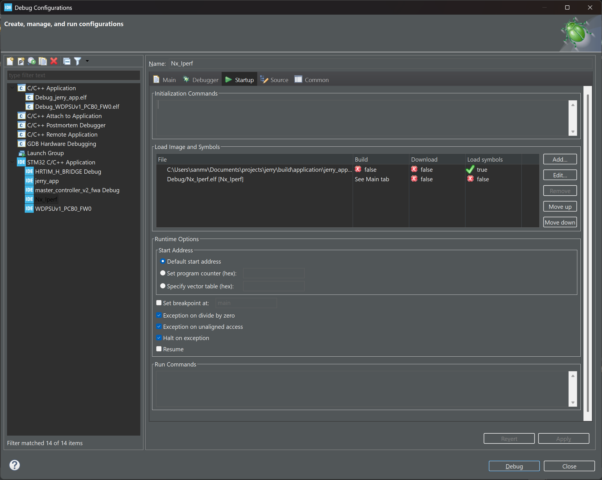

# Jerry

Jerry is a data acquisition firmware designed for microcontrollers, specifically targeting the STM32H5xxx series. It is built with high reliability and security in mind, utilizing FreeRTOS with static allocation and adhering to strict coding standards.

## Project Architecture

-   **Firmware**: C and Assembly (No dynamic memory allocation).
-   **OS**: FreeRTOS (Statically allocated).
-   **Build System**: CMake.
-   **Tooling**: Python scripts managed by `uv`.
-   **Testing**: Unity (Firmware), Pytest (Tools).

## Key Features

-   **System Monitoring**: Stack overflow and usage tracking.
-   **FOTA**: Secure Firmware Over The Air updates.
-   **Communication**:
    -   Modbus TCP/IP (Ethernet).
    -   Modbus RTU (UART).
    -   Logging via dedicated UART.
-   **I/O Capabilities**:
    -   8x Digital Inputs.
    -   16x Digital Outputs.
    -   4x ADC Inputs.
    -   4x PWM Outputs.

## Development Setup

### Prerequisites

Assumption is that all the tools listed below are on terminal path.

-   **CMake**: >= 3.20
-   **Python**: >= 3.10
-   **uv**: Python project manager.
-   **Ninja**: Ninja build system 

Vendor specific tools:
-   **STM32CubeCLT**: expects `STM32CLT_PATH` environment variable in shell.
-   **STM32CubeIDE**: expects `STM32CubeIDE` environment variable in shell.

### Build Instructions

1.  **Configure the project**:
    ```bash
    cmake -S . -B build -G Ninja -DCMAKE_TOOLCHAIN_FILE=application/bsp/toolchain.cmake -DVENDOR=stm
    ```

2.  **Build the firmware**:
    ```bash
    cmake --build build
    ```

This will produce two binaries:
-   `build/application/bsp/stm/stm32h563/jerry_secure_app.elf` (Secure Application)
-   `build/application/jerry_app.elf` (Non-Secure Application)

## Available Commands

This project leverages CMake custom targets to integrate quality assurance tools.

### Code Formatting

Format C/C++ and Python code:
```bash
cmake --build build --target format
```

### Static Analysis & Linting

Run all quality checks (CppCheck, Lizard, Pylint, Ruff):
```bash
cmake --build build --target lint
```

Run individual tools:

-   **CppCheck** (Static Analysis):
    ```bash
    cmake --build build --target cppcheck
    ```
-   **Lizard** (Complexity Metrics):
    ```bash
    cmake --build build --target lizard
    ```
-   **Pylint** (Python Linting):
    ```bash
    cmake --build build --target pylint
    ```
-   **Ruff** (Python Formatting/Linting):
    ```bash
    cmake --build build --target ruff
    ```

## Coding Standards

-   **C/C++**: [Google CPP Coding Style](refs/cpp_coding_style.md)
-   **Python**: [Google Python Coding Style](refs/python_coding_style.md)   
-   **Shell**: [Google Shell Coding Style](refs/shell_style_guide.md)

## Vendor Specific Notes

### STM32H563

#### Device Configuration & Flashing (First Time Setup)

Since this project uses **TrustZone**, the STM32H563 device option bytes **MUST** be configured correctly before flashing. If the device is in a default state (TZEN=0), the application will not boot.

**WARNING:** Modifying Option Bytes, specifically enabling TZEN, may perform a mass erase of the flash memory.

##### 1. Enable TrustZone and Configure Secure Boot

Use `STM32_Programmer_CLI` (part of STM32CubeCLT) to set the Option Bytes. Here, it assumes that `STM32CubeCLT` is installed as this application sets up and put `STM32_Programmer_CLI` on terminal on path.

**Step 1: Enable TrustZone**
```bash
STM32_Programmer_CLI -c port=SWD -ob TZEN=0xB4
```
*Note: This enables TrustZone. The device may reset.*

**Step 2: Configure Secure Areas and Boot Address**
Once TrustZone is enabled, you must define the Secure memory regions and the Secure Boot Address.
-   **Bank 1**: Secure (default behavior with `SECWM1_STRT=0`, `SECWM1_END=0x7F`).
-   **Bank 2**: Non-Secure (configured by `SECWM2_STRT=0x7F`, `SECWM2_END=0x0`).
-   **Secure Boot Address**: Points to the start of Secure Flash (Bank 1).

Run this command:
```bash
STM32_Programmer_CLI -c port=SWD -ob SECWM2_STRT=0x7F SECWM2_END=0x0 SECBOOTADD=0x0C0000
```

##### 2. Flash the Firmware

You must flash **both** the Secure and Non-Secure applications.

**Flash Secure App (to 0x0C000000):**
```bash
STM32_Programmer_CLI -c port=SWD -w build/application/bsp/stm/stm32h563/jerry_secure_app.elf -v -rst
```

**Flash Non-Secure App (to 0x08100000):**
```bash
STM32_Programmer_CLI -c port=SWD -w build/application/jerry_app.elf -v -rst
```

#### 3. Debugging tips 

Although a sample vscode's cortex-debug extension configuration has been provided. It is in `.vscode/launch.json`. User can select `OpenOCD STM32H563` launch config in `Run and Debug` view of vscode. 

However, the recommendation is to use STM32CubeIDE environment. To set up the debug configuration for this project, follow the following steps:
1. import any example of Nucleo-H563 board, here, `Nx_perf` example has been imported.
2. Open `debug configuration` of this project. 
3. In `Debugger` tab, `Debug Probe` should be `ST-LINK (OpenOCD)`
4. In `Startup` tab, make sure to have the configs as per the following image

    As per these settings, `Nx_Perf` app binary will not be loaded, but rather we are loading only the symbol of our non-secure application. **Imp:** this assumes that both secure and non-secure part of this application has been downloaded (see `Flash the Firmware` section). Also, it does not runs to any symbol or resumes.

Once the above debug configuration file has been set
1. download the both secure and non-secure part of this application (see `Flash the Firmware` section).
2. Debug the `Nx_perf` as `STM32 C/C++ Application`. 

#### 4. System Timer (SysTick) Behavior

In this TrustZone configuration:
-   **Secure World**: Uses the standard **Core SysTick** timer for its timebase.
-   **Non-Secure World**: Uses **TIM6** (Basic Timer) for its timebase (HAL Tick).

**Behavior Fix**:
By default, the Secure SysTick remains active after jumping to the Non-Secure application, causing periodic interrupts that preempt the Non-Secure code. To prevent this overhead (if Secure world background tasks are not needed), the Secure SysTick is explicitly **disabled** (`SysTick->CTRL = 0`) in `Secure/Core/Src/main.c` immediately before the jump to the Non-Secure vector table.

## TODO

1. Currently, `MX_Device.h` file has to be generated using the following command:
```bash
uv run tools/MX_Device_gen.py application/bsp/stm/stm32h563/stm32h563.ioc --logfile build/mx_device_gen.log.txt
```
This generation step is good to be automated.
