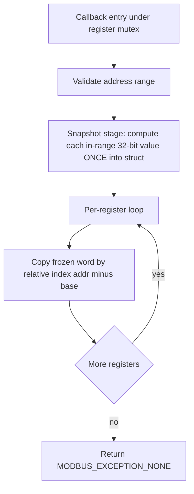

# BUG-19 Fix Plan — Non-atomic 32-bit float / multi-register reads in Modbus callbacks

**Issue:** [`plans/issues/BUG-19-non-atomic-float-reads.md`](issues/BUG-19-non-atomic-float-reads.md)
**Primary file:** [`application/src/modbus_device_callbacks.c`](../application/src/modbus_device_callbacks.c)
**Related:** BUG-02 (HR float indexing), BUG-03 (IR calibrated indexing), BUG-04 (register thread-safety)

---

## 1. Problem Analysis

A 32-bit value (`float32` or `uint32`) is stored across **two consecutive Modbus registers** by convention. The read callbacks compute the 32-bit value **once per register case** inside the per-register `for` loop. This causes two classes of tearing:

1. **Within-transaction tear** — for a 2-register read the value is produced at `addr == base` and again at `addr == base + 1`. If the underlying source changes between the two iterations, the two halves come from different snapshots and reassemble to a corrupt bit pattern.
2. **Cross-transaction tear** — if a master reads the two words in separate requests, the source is re-sampled in between. This cannot be fixed on the slave alone and must be documented as a master-side contract.

### Severity multiplier: input-register ADC re-sampling

The worst case is in [`modbus_cb_read_input_registers()`](../application/src/modbus_device_callbacks.c:1485). Each calibrated-value case calls [`update_calibrated_adcval()`](../application/src/modbus_device_callbacks.c:129), which **re-reads the ADC and recomputes the float inside the read loop**. So even a single 2-register transaction samples the ADC twice — guaranteed within-transaction tear whenever the signal moves.

### Mutex status (BUG-04 interaction) — already satisfied

The entire callback dispatch in [`modbus_task.c`](../application/src/modbus_task.c:396) runs between `RegisterLock_Acquire()` (line 396) and `RegisterLock_Release()` (line 587). **Therefore any snapshot taken inside a callback is already protected by the register mutex.** No new locking is needed inside the callbacks; the BUG-19 fix is purely structural (snapshot once at callback entry, then copy frozen words by relative index `i`).

> Note: This plan assumes BUG-02 and BUG-03 (correct relative-index `register_values[i]` usage) are either already applied or applied together with this fix. The current source already uses `register_values[i]` with the relative `word_index = addr - base` pattern, so the indexing fix appears in place; BUG-19 is the remaining "compute once" change.

---

## 2. Complete Inventory of Affected Multi-Register Cases

### 2.1 Holding registers — [`modbus_cb_read_holding_registers()`](../application/src/modbus_device_callbacks.c:871)

| Group | Base macro | Type | Lines | Source / volatility |
|-------|-----------|------|-------|---------------------|
| PWM 0 frequency | `JERRY_DEVICE_HR_PWM_0_FREQUENCY` | uint32 | 916-925 | struct field (static) |
| PWM 1 frequency | `JERRY_DEVICE_HR_PWM_1_FREQUENCY` | uint32 | 929-938 | struct field (static) |
| PWM 2 frequency | `JERRY_DEVICE_HR_PWM_2_FREQUENCY` | uint32 | 942-951 | struct field (static) |
| PWM 3 frequency | `JERRY_DEVICE_HR_PWM_3_FREQUENCY` | uint32 | 955-964 | struct field (static) |
| App build number | `JERRY_DEVICE_HR_APP_BUILD_NUMBER` | uint32 | 1026-1038 | refreshed from `APP_BUILD_NUMBER` per case |
| ADC0 scale/offset/dead_zone | `JERRY_DEVICE_HR_ADC_0_*` | float32 | 1043-1060 | struct field (static) |
| ADC1 scale/offset/dead_zone | `JERRY_DEVICE_HR_ADC_1_*` | float32 | 1063-1080 | struct field (static) |
| ADC2 scale/offset/dead_zone | `JERRY_DEVICE_HR_ADC_2_*` | float32 | 1083-1100 | struct field (static) |
| ADC3 scale/offset/dead_zone | `JERRY_DEVICE_HR_ADC_3_*` | float32 | 1103-1120 | struct field (static) |

Single-register dynamic sources in the same callback (lower risk but should snapshot once for consistency):
- ADC values (16-bit) — [`update_reg_with_adcval()`](../application/src/modbus_device_callbacks.c:89) re-reads ADC per case (lines 965-984). Single register so no *tear*, but redundant sampling.
- System tick — [`update_system_tick_registers()`](../application/src/modbus_device_callbacks.c:169) called twice (lines 985-994) re-reads the tick; low/high words can come from two different tick reads → **uint32 tick tear** if the read straddles a 16-bit rollover boundary. **This is a multi-register tear case and must be included.**

### 2.2 Input registers — [`modbus_cb_read_input_registers()`](../application/src/modbus_device_callbacks.c:1485)

| Group | Base macro | Type | Lines | Source / volatility |
|-------|-----------|------|-------|---------------------|
| ADC0 calibrated | `JERRY_DEVICE_IR_ADC_0_CALIBRATED_VALUE` | float32 | 1520-1528 | **re-samples ADC** via `update_calibrated_adcval()` |
| ADC1 calibrated | `JERRY_DEVICE_IR_ADC_1_CALIBRATED_VALUE` | float32 | 1529-1537 | **re-samples ADC** |
| ADC2 calibrated | `JERRY_DEVICE_IR_ADC_2_CALIBRATED_VALUE` | float32 | 1538-1546 | **re-samples ADC** |
| ADC3 calibrated | `JERRY_DEVICE_IR_ADC_3_CALIBRATED_VALUE` | float32 | 1547-1555 | **re-samples ADC** |
| App build number | `JERRY_DEVICE_IR_APP_BUILD_NUMBER` | uint32 | 1569-1581 | refreshed per case |

Single-register raw ADC values (lines 1508-1519) just copy `regs->adc_x_value` — no tear; leave as-is.

### Summary count
- **Holding registers:** 4 PWM-freq (uint32) + 1 build-number (uint32) + 1 system-tick (uint32) + 12 ADC-calibration floats = **18 multi-register cases**.
- **Input registers:** 4 calibrated floats + 1 build-number = **5 multi-register cases**.

---

## 3. Design: Snapshot-then-Copy Pattern

### Core idea
Before the per-register `for` loop, compute **every** value the requested range can touch **once** into the backing struct (which is already mutex-protected). The loop then becomes pure copy logic: split the already-frozen 32-bit struct fields into words by relative index `addr - base`.

### 3.1 Generic 32-bit word extraction helper

A single helper replaces the three existing ad-hoc patterns (`f32_word_to_reg`, manual `>>16`/`&0xFFFF`, and `unpack_float_t`). Keep [`f32_word_to_reg()`](../application/src/modbus_device_callbacks.c:60) and add a uint32 sibling so all 32-bit cases share one word-order convention:

```c
/**
 * @brief Emit one 16-bit word of a frozen 32-bit unsigned value.
 * @param val        The already-snapshotted 32-bit value.
 * @param word_index 0 = first (high) word, 1 = second (low) word.
 * @param reg_slot   Destination &register_values[i].
 *
 * Word order MUST match the write path: high word first (u16[0]) at base,
 * low word (u16[1]) at base+1, consistent with the existing >>16 / &0xFFFF code.
 */
static inline void u32_word_to_reg(uint32_t val, uint16_t word_index,
                                   uint16_t *reg_slot)
{
    *reg_slot = (word_index & 1U) ? (uint16_t)(val & 0xFFFFU)
                                  : (uint16_t)(val >> 16U);
}
```

> **Word-order caution:** `f32_word_to_reg()` uses `unpack_float_t.u16[word_index]` (memory order), whereas the uint32 PWM/build cases use explicit `>>16` (high word first). These are two different conventions today. The refactor MUST preserve each field's *existing* observable byte order to avoid breaking masters already decoding the device. Do not "unify" float and uint32 ordering — only deduplicate within each convention. Document the per-type convention in the README contract section.

### 3.2 Snapshot stage for holding registers

Add a snapshot block immediately after the existing RTC-refresh block (after line 904), gated so it only does work when the requested range overlaps each source. Snapshot into the struct fields, then the loop only reads struct fields:

```c
/* ---- Snapshot stage (BUG-19): compute every volatile/32-bit value once ---- */

/* System tick: write both words from a single tick read. */
if (range_includes(start_address, end_address,
                   JERRY_DEVICE_HR_SYSTEM_TICK_LOW,
                   JERRY_DEVICE_HR_SYSTEM_TICK_HIGH))
{
    update_system_tick_registers(regs);   /* one xTaskGetTickCount() */
}

/* Build number: refresh once. */
if (range_includes(start_address, end_address,
                   JERRY_DEVICE_HR_APP_BUILD_NUMBER,
                   JERRY_DEVICE_HR_APP_BUILD_NUMBER + 1U))
{
    regs->app_build_number = APP_BUILD_NUMBER;
}

/* ADC raw values: sample each channel at most once if in range. */
if (addr_in_range(start_address, end_address, JERRY_DEVICE_HR_ADC_0_VALUE))
    update_reg_with_adcval(BSP_ADC1_CHANNEL_A0, &regs->adc_0_value, &regs->adc_0_value /* scratch */);
/* ...A1..A3 similarly... */
```

Then the loop bodies for these cases reduce to:

```c
case JERRY_DEVICE_HR_PWM_0_FREQUENCY:
case JERRY_DEVICE_HR_PWM_0_FREQUENCY + 1U:
    u32_word_to_reg((uint32_t)regs->pwm_0_frequency,
                    addr - JERRY_DEVICE_HR_PWM_0_FREQUENCY,
                    &register_values[i]);
    break;
```

> **Helper note:** `update_reg_with_adcval()` currently writes to *both* a struct field and an array slot. For the snapshot stage we only want it to update the struct field. Refactor it (or add a variant) so the "sample into struct" step is separate from the "copy struct word to response slot" step. Simplest: split into `sample_adc_into_struct(channel, &field)` (snapshot stage) and let the loop just do `register_values[i] = (uint16_t)regs->adc_x_value;`.

### 3.3 Snapshot stage for input registers (the important one)

Replace the per-case `update_calibrated_adcval()` calls with a single snapshot pass that samples each in-range channel once into the struct, then a pure-copy loop:

```c
/* ---- Snapshot stage (BUG-19) ---- */
if (range_includes(start, end, IR_ADC_0_CALIBRATED, IR_ADC_0_CALIBRATED+1))
    sample_calibrated_into_struct(BSP_ADC1_CHANNEL_A0,
        hrRegs->adc_0_scale_factor, hrRegs->adc_0_offset_term,
        hrRegs->adc_0_dead_zone, &regs->adc_0_calibrated_value);
/* ...A1..A3... */

if (range_includes(start, end, IR_APP_BUILD_NUMBER, IR_APP_BUILD_NUMBER+1))
    regs->app_build_number = APP_BUILD_NUMBER;
```

Where `sample_calibrated_into_struct()` is `update_calibrated_adcval()` minus the `word_index`/`pRegSlot` arguments — it only computes and stores `*pCalibratedField`. The loop then becomes:

```c
case JERRY_DEVICE_IR_ADC_0_CALIBRATED_VALUE:
case JERRY_DEVICE_IR_ADC_0_CALIBRATED_VALUE + 1:
    f32_word_to_reg(regs->adc_0_calibrated_value,
                    addr - JERRY_DEVICE_IR_ADC_0_CALIBRATED_VALUE,
                    &register_values[i]);
    break;
```

### 3.4 Range-overlap helper

Add one small helper to decide whether a 2-register span intersects the requested `[start, end]` window:

```c
static inline bool range_includes(uint16_t start, uint16_t end,
                                  uint16_t lo, uint16_t hi)
{
    return (start <= hi) && (end >= lo);
}
```

(`addr_in_range` for single registers is `range_includes(start, end, a, a)`.)

### Data flow (snapshot-then-copy)



---

## 4. Documentation Updates

| # | Target | Change |
|---|--------|--------|
| 1 | [`config/jerry_registers.json`](../config/jerry_registers.json) | Add a device-level note (e.g. in `device.description` or a new `notes` field if schema allows) stating that `size 2` registers are a single 32-bit value and MUST be read in one transaction. Verify schema permits the field first. |
| 2 | [`tools/modbus_codegen/modbus_codegen.py`](../tools/modbus_codegen/modbus_codegen.py:285) | In `generate_register_documentation()`, append an atomicity legend/footnote for `size == 2` rows (HR block ~line 312, IR block ~line 333). Mark each 2-register row (e.g. trailing `[2-reg atomic: read together]`) and add a footnote explaining word order. Regenerates `jerry_device_register_map.txt` — do **not** hand-edit the generated file. |
| 3 | [`README.md`](../README.md:211) | Add an integrator note to the Modbus section: two-register 32-bit convention, per-type word order (float = memory order via union; uint32 = high-word-first), and the single-transaction requirement for atomic reads. |
| 4 | [`docs/FIRMWARE_README.md`](../docs/FIRMWARE_README.md) | (Optional) cross-reference the README contract. |
| 5 | Source comments | Add a header comment block to [`modbus_device_callbacks.c`](../application/src/modbus_device_callbacks.c) describing the snapshot-then-copy invariant so future edits keep computation in the snapshot stage, not the loop. |

---

## 5. Tests

| # | Target | Change |
|---|--------|--------|
| 1 | [`tests/integration/test_holding_registers.py`](../tests/integration/test_holding_registers.py) | Add a test reading each `size 2` HR (PWM freq, build number) in **one** transaction and asserting a coherent 32-bit reassembly. Add a stability test: read system-tick low+high in one transaction repeatedly and assert monotonic, non-torn 32-bit values. |
| 2 | [`tests/integration/register_map.py`](../tests/integration/register_map.py) | Ensure the 2-register addresses/types are represented for the new tests. |
| 3 | New IR integration test | Read each calibrated value (2-reg) in one transaction with a steady input and assert the decoded float is sane / repeatable (proves single-sample snapshot). |
| 4 | [`tests/unit/test_modbus_callbacks.c`](../tests/unit/test_modbus_callbacks.c) | These are link stubs; no change required unless host-side unit coverage of the snapshot helpers is added. Optional: a host unit test for `u32_word_to_reg` / `f32_word_to_reg` word-order. |

---

## 6. Ready-to-Implement Checklist

**Helpers (top of [`modbus_device_callbacks.c`](../application/src/modbus_device_callbacks.c))**
- [ ] Add `range_includes(start, end, lo, hi)` inline helper.
- [ ] Add `u32_word_to_reg(val, word_index, reg_slot)` (high-word-first, matching existing PWM/build code).
- [ ] Split `update_reg_with_adcval()` into a snapshot-only `sample_adc_into_struct(channel, &field)` (keep response copy in the loop).
- [ ] Split `update_calibrated_adcval()` into snapshot-only `sample_calibrated_into_struct(...)` (drop `word_index`/`pRegSlot`).

**Holding-register callback ([`modbus_cb_read_holding_registers`](../application/src/modbus_device_callbacks.c:871))**
- [ ] After RTC refresh, add snapshot stage: system tick (once), build number (once), four ADC raw values (once each, in-range only).
- [ ] Convert PWM 0-3 frequency cases to `u32_word_to_reg` reading the frozen struct field.
- [ ] Convert build-number cases to `u32_word_to_reg` (remove per-case refresh).
- [ ] Convert ADC raw-value cases to plain `register_values[i] = (uint16_t)regs->adc_x_value;`.
- [ ] Convert system-tick cases to plain copies of `regs->system_tick_low/high` (remove per-case `update_system_tick_registers`).
- [ ] Leave ADC-calibration float cases as `f32_word_to_reg` (already copy frozen struct fields — confirm no recompute).

**Input-register callback ([`modbus_cb_read_input_registers`](../application/src/modbus_device_callbacks.c:1485))**
- [ ] Add snapshot stage before the loop: sample each in-range calibrated channel once; refresh build number once.
- [ ] Convert calibrated cases to `f32_word_to_reg(regs->adc_x_calibrated_value, addr - base, &register_values[i])`.
- [ ] Convert build-number cases to `u32_word_to_reg` (remove per-case refresh).
- [ ] Leave raw ADC-value single-register cases unchanged.

**Documentation**
- [ ] Add 32-bit atomicity note to [`config/jerry_registers.json`](../config/jerry_registers.json) (after confirming schema support).
- [ ] Update codegen doc generator to emit atomicity legend/footnote for `size 2` rows.
- [ ] Regenerate `jerry_device_register_map.txt` via the build (do not hand-edit).
- [ ] Add integrator note (convention + word order + single-transaction rule) to [`README.md`](../README.md:211).
- [ ] Add a snapshot-then-copy invariant comment block in the callbacks file.

**Tests**
- [ ] Add single-transaction 32-bit read tests for HR (PWM freq, build, system tick) in [`test_holding_registers.py`](../tests/integration/test_holding_registers.py).
- [ ] Add single-transaction calibrated-value read tests for IR.
- [ ] (Optional) host unit tests for word-order helpers.

**Verification**
- [ ] Build firmware; confirm codegen regenerates the doc with the legend.
- [ ] Run unit suite ([`tests/unit`](../tests/unit)).
- [ ] Run integration suite against device/simulator; confirm no torn 32-bit reads under a changing ADC input.
- [ ] Confirm word order unchanged vs. pre-fix for every 32-bit register (regression guard for existing masters).

---

## 7. Out of Scope / Explicitly Deferred

- **Cross-transaction tearing** cannot be fixed slave-side; handled by the documented single-transaction contract. The optional "latch/freeze coil" from the issue is **deferred** — note it as a future enhancement, not part of this fix.
- **BUG-04 mutex insertion** is already satisfied by the lock around dispatch in [`modbus_task.c`](../application/src/modbus_task.c:396); no new locking added here.
- **BUG-02/03 index correctness** appears already applied (relative `register_values[i]`); this plan only removes per-loop recomputation.
