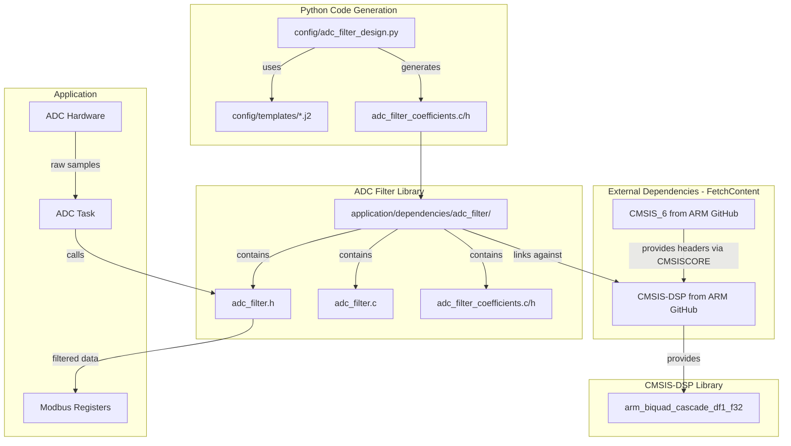
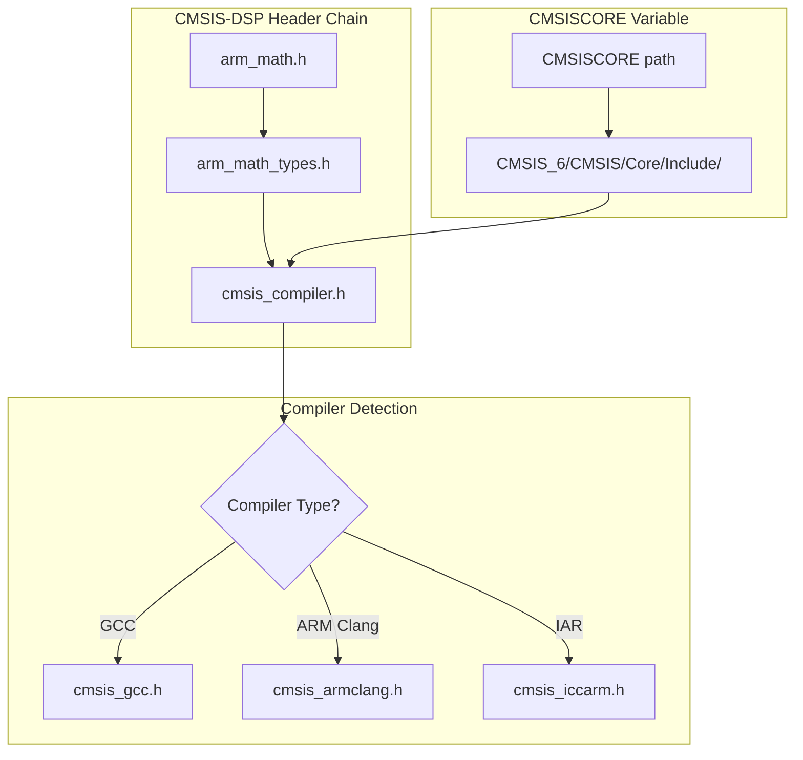

# ADC Filter Architecture Plan

## Overview

This document describes the architecture for implementing digital filtering on ADC inputs for the Jerry data acquisition firmware. The filter chain consists of a 4th order Butterworth low-pass filter with 500Hz cutoff and 10 IIR notch filters to reject 50Hz mains frequency and its harmonics.

## Design Specifications

| Parameter | Value |
|-----------|-------|
| Sampling Rate | 10 kHz |
| Number of ADC Channels | 4 |
| LPF Type | 4th order Butterworth |
| LPF Cutoff Frequency | 500 Hz |
| Notch Frequencies | 50, 100, 150, 200, 250, 300, 350, 400, 450, 500 Hz |
| Total Biquad Sections | 12 per channel (2 LPF + 10 notch) |

## Computational Complexity

| Metric | Value |
|--------|-------|
| Operations per sample | 12 sections × 5 MACs = 60 MACs |
| Operations per second (1 channel) | 60 × 10,000 = 600,000 MACs/s |
| Operations per second (4 channels) | 2.4 million MACs/s |
| CPU Usage at 250MHz | ~1.7% |
| Coefficient Memory | 12 × 5 × 4 bytes = 240 bytes (shared) |
| State Memory per channel | 12 × 4 × 4 bytes = 192 bytes |
| Total State Memory (4 channels) | 768 bytes |

## Architecture

### Component Diagram



### Filter Signal Flow


## Directory Structure

```
application/
├── CMakeLists.txt              # Main build config with FetchContent for CMSIS
├── dependencies/
│   ├── CMSIS_6/                # Downloaded via FetchContent (git-ignored)
│   │   └── CMSIS/
│   │       └── Core/
│   │           └── Include/    # Core headers (cmsis_compiler.h, etc.)
│   ├── CMSIS-DSP/              # Downloaded via FetchContent (git-ignored)
│   │   ├── Include/            # DSP headers (arm_math.h, etc.)
│   │   └── Source/             # DSP source files (776 files)
│   └── adc_filter/
│       ├── CMakeLists.txt
│       ├── inc/
│       │   ├── adc_filter.h
│       │   └── adc_filter_coefficients.h
│       └── src/
│           ├── adc_filter.c
│           └── adc_filter_coefficients.c
config/
├── adc_filter_design.py
└── templates/
    ├── adc_filter_coefficients.c.j2
    └── adc_filter_coefficients.h.j2
```

## Python Filter Design Script

### Location
`config/adc_filter_design.py`

### Responsibilities
1. Design 4th order Butterworth LPF using scipy.signal
2. Design 10 IIR notch filters using scipy.signal.iirnotch
3. Convert filter coefficients to second-order sections (SOS) format
4. Generate C header and source files with coefficients in CMSIS-DSP format

### Output Files
- `application/dependencies/adc_filter/inc/adc_filter_coefficients.h`
- `application/dependencies/adc_filter/src/adc_filter_coefficients.c`

### Coefficient Format for CMSIS-DSP
Each biquad section requires 5 coefficients in order: `{b0, b1, b2, a1, a2}`

Note: CMSIS-DSP uses negated `a1` and `a2` coefficients compared to standard notation.

### Example Generated Code Structure

```c
// adc_filter_coefficients.h
#ifndef ADC_FILTER_COEFFICIENTS_H
#define ADC_FILTER_COEFFICIENTS_H

#include "arm_math.h"

#define ADC_FILTER_NUM_STAGES 12

extern const float32_t adc_filter_coefficients[ADC_FILTER_NUM_STAGES * 5];

#endif
```

```c
// adc_filter_coefficients.c
#include "adc_filter_coefficients.h"

const float32_t adc_filter_coefficients[ADC_FILTER_NUM_STAGES * 5] = {
    // LPF Stage 1: b0, b1, b2, -a1, -a2
    0.0f, 0.0f, 0.0f, 0.0f, 0.0f,
    // LPF Stage 2: b0, b1, b2, -a1, -a2
    0.0f, 0.0f, 0.0f, 0.0f, 0.0f,
    // Notch 50Hz: b0, b1, b2, -a1, -a2
    0.0f, 0.0f, 0.0f, 0.0f, 0.0f,
    // ... remaining notch filters
};
```

## C Filter Library API

### Header File: adc_filter.h

```c
#ifndef ADC_FILTER_H
#define ADC_FILTER_H

#include "arm_math.h"
#include <stdint.h>
#include <stdbool.h>

#define ADC_FILTER_NUM_CHANNELS     4
#define ADC_FILTER_NUM_STAGES       12
#define ADC_FILTER_STATE_SIZE       (ADC_FILTER_NUM_STAGES * 4)

// Filter instance for a single channel
typedef struct {
    arm_biquad_casd_df1_inst_f32 instance;
    float32_t state[ADC_FILTER_STATE_SIZE];
    bool initialized;
} adc_filter_channel_t;

// Filter context for all channels
typedef struct {
    adc_filter_channel_t channels[ADC_FILTER_NUM_CHANNELS];
} adc_filter_context_t;

// Initialize all filter channels
void adc_filter_init(adc_filter_context_t *ctx);

// Process a single sample for one channel
float32_t adc_filter_process_sample(adc_filter_context_t *ctx,
                                     uint8_t channel,
                                     float32_t input);

// Process a block of samples for one channel
void adc_filter_process_block(adc_filter_context_t *ctx,
                               uint8_t channel,
                               const float32_t *input,
                               float32_t *output,
                               uint32_t block_size);

// Reset filter state for a channel
void adc_filter_reset(adc_filter_context_t *ctx, uint8_t channel);

// Reset all filter states
void adc_filter_reset_all(adc_filter_context_t *ctx);

#endif
```

### Implementation: adc_filter.c

Key implementation details:
1. Static allocation of all filter state variables
2. Shared coefficients across all channels
3. Per-channel state variables for independent filtering
4. Support for both sample-by-sample and block processing

## CMake Integration

### Filter Library CMakeLists.txt

```cmake
# application/dependencies/adc_filter/CMakeLists.txt

add_library(adc_filter STATIC
    src/adc_filter.c
    src/adc_filter_coefficients.c
)

target_include_directories(adc_filter
    PUBLIC
        ${CMAKE_CURRENT_SOURCE_DIR}/inc
)

target_link_libraries(adc_filter
    PUBLIC
        CMSIS_DSP
)
```

### Application CMakeLists.txt Integration

Add to `application/CMakeLists.txt`:
```cmake
add_subdirectory(dependencies/adc_filter)

target_link_libraries(${PROJECT_NAME}
    PRIVATE
        adc_filter
)
```

## ADC Task Integration

### Task Design

The ADC task will:
1. Initialize the filter context at startup
2. Read ADC samples at 10kHz rate (using timer interrupt or DMA)
3. Apply filtering to each sample
4. Store filtered values in Modbus registers

### Integration with Existing Code

Modify `application/src/peripheral_adapters.c` to include filtering:

```c
#include "adc_filter.h"

static adc_filter_context_t g_adc_filter_ctx;

void peripheral_adc_init(void) {
    // Initialize ADC hardware
    // ...

    // Initialize filters
    adc_filter_init(&g_adc_filter_ctx);
}

uint16_t peripheral_adc_read(uint8_t channel) {
    // Read raw ADC value
    uint16_t raw_value = /* HAL ADC read */;

    // Convert to float
    float32_t input = (float32_t)raw_value;

    // Apply filter
    float32_t filtered = adc_filter_process_sample(&g_adc_filter_ctx,
                                                    channel,
                                                    input);

    // Convert back to uint16_t
    return (uint16_t)filtered;
}
```

## Memory Layout

### Static Allocation Summary

| Component | Size | Notes |
|-----------|------|-------|
| Coefficients | 240 bytes | Shared across all channels |
| State Ch0 | 192 bytes | 12 stages × 4 state vars × 4 bytes |
| State Ch1 | 192 bytes | |
| State Ch2 | 192 bytes | |
| State Ch3 | 192 bytes | |
| Filter instances | 64 bytes | 4 × arm_biquad_casd_df1_inst_f32 |
| **Total** | **~1 KB** | |

## Implementation Checklist

### Phase 1: Python Script
- [ ] Create `config/adc_filter_design.py`
- [ ] Implement Butterworth LPF design
- [ ] Implement notch filter design for all harmonics
- [ ] Generate C coefficient files
- [ ] Add unit tests for coefficient generation

### Phase 2: C Filter Library
- [ ] Create directory structure
- [ ] Implement `adc_filter.h` API
- [ ] Implement `adc_filter.c`
- [ ] Create CMakeLists.txt
- [ ] Add unit tests for filter processing

### Phase 3: Integration
- [ ] Integrate with application CMakeLists.txt
- [ ] Modify peripheral_adapters for filtering
- [ ] Create ADC sampling task (if not exists)
- [ ] Update Modbus register mapping for filtered values
- [ ] Integration testing

### Phase 4: Validation
- [ ] Verify filter frequency response
- [ ] Measure actual CPU usage
- [ ] Test 50Hz rejection performance
- [ ] Validate with real ADC signals

## Dependencies

### Required
- CMSIS-DSP library (fetched from ARM GitHub via FetchContent)
- CMSIS_6 (fetched from ARM GitHub via FetchContent)
- Python 3.x with scipy, numpy, jinja2

### Python Dependencies
```
scipy>=1.7.0
numpy>=1.20.0
jinja2>=3.0.0
```

## CMSIS-DSP Integration Architecture

### Overview

The project uses the official ARM CMSIS-DSP library fetched directly from GitHub using CMake's FetchContent module. This approach ensures we always have access to the latest optimized DSP functions without relying on vendor-provided libraries.

### FetchContent Configuration

The CMSIS-DSP and CMSIS_6 repositories are fetched in [`application/CMakeLists.txt`](application/CMakeLists.txt):

```cmake
# Dependencies path
set(DEPS_PATH "${CMAKE_CURRENT_SOURCE_DIR}/dependencies")

# CMSIS-DSP Configuration (must be set BEFORE FetchContent_MakeAvailable)
set(ARM_CPU "cortex-m33" CACHE STRING "ARM CPU type")
set(CMSISCORE "${DEPS_PATH}/CMSIS_6/CMSIS/Core/Include" CACHE PATH "Path to CMSIS Core headers")

# FetchContent declarations
FetchContent_Declare(FCD_cmsis_6
    GIT_REPOSITORY https://github.com/ARM-software/CMSIS_6.git
    GIT_TAG        v6.1.0
    SOURCE_DIR     ${DEPS_PATH}/CMSIS_6
)

FetchContent_Declare(FCD_cmsis_dsp
    GIT_REPOSITORY https://github.com/ARM-software/CMSIS-DSP.git
    GIT_TAG        v1.16.2
    SOURCE_DIR     ${DEPS_PATH}/CMSIS-DSP
)

# Make dependencies available
FetchContent_MakeAvailable(FCD_cmsis_6 FCD_cmsis_dsp)

# Configure CMSISDSP target after FetchContent creates it
if(TARGET CMSISDSP)
    target_compile_definitions(CMSISDSP PUBLIC
        ARM_MATH_CM33
        ARM_MATH_LOOPUNROLL
    )
    target_include_directories(CMSISDSP PUBLIC
        ${CMSISCORE}
    )
endif()
```

### CMSISCORE Variable Mechanism

The key to making CMSIS-DSP work with CMSIS_6 is the `CMSISCORE` variable. This is how the integration works:



**Header Include Chain:**
1. [`arm_math.h`](application/dependencies/CMSIS-DSP/Include/arm_math.h) - Main CMSIS-DSP header
2. [`arm_math_types.h`](application/dependencies/CMSIS-DSP/Include/arm_math_types.h) - Type definitions
3. [`cmsis_compiler.h`](application/dependencies/CMSIS_6/CMSIS/Core/Include/cmsis_compiler.h) - Compiler abstraction (from CMSIS_6)
4. Compiler-specific headers (e.g., `cmsis_gcc.h`) - Intrinsics and optimizations

The `CMSISCORE` variable tells CMSIS-DSP where to find the CMSIS Core headers. Without this, the build would fail because `arm_math_types.h` includes `cmsis_compiler.h` which is part of CMSIS_6, not CMSIS-DSP.

### Build Configuration

**Critical Order of Operations:**
1. Set `CMSISCORE` variable **BEFORE** `FetchContent_MakeAvailable`
2. CMSIS-DSP's CMakeLists.txt reads `CMSISCORE` during configuration
3. After `FetchContent_MakeAvailable`, the `CMSISDSP` target exists
4. Additional compile definitions can be added to the target

**Compile Definitions:**
| Definition | Purpose |
|------------|---------|
| `ARM_MATH_CM33` | Enables Cortex-M33 optimizations |
| `ARM_MATH_LOOPUNROLL` | Enables loop unrolling for performance |

### Build Output

The full CMSIS-DSP library compilation produces:
- **776 object files** compiled from the Source directory
- **libCMSISDSP.a** static library (~2.5 MB)
- Includes all DSP functions: filtering, transforms, matrix operations, statistics, etc.

### ADC Filter Library Linkage

The [`adc_filter`](application/dependencies/adc_filter/CMakeLists.txt) library links against CMSISDSP:

```cmake
add_library(adc_filter STATIC
    ${CMAKE_CURRENT_SOURCE_DIR}/src/adc_filter.c
    ${CMAKE_CURRENT_SOURCE_DIR}/src/adc_filter_coefficients.c
)

target_include_directories(adc_filter
    PUBLIC
        ${CMAKE_CURRENT_SOURCE_DIR}/inc
)

target_link_libraries(adc_filter
    PUBLIC
        CMSISDSP
)
```

### Git Ignore Configuration

The fetched CMSIS repositories are excluded from version control in [`.gitignore`](.gitignore):

```gitignore
# CMSIS dependencies (fetched via FetchContent)
application/dependencies/CMSIS-DSP/
application/dependencies/CMSIS_6/
```

### Memory Impact

| Component | Size |
|-----------|------|
| libCMSISDSP.a (full library) | ~2.5 MB |
| Linked functions (after LTO) | ~10-20 KB |
| Filter coefficients | 240 bytes |
| Filter state (4 channels) | 768 bytes |

Note: The linker only includes functions that are actually used, so the final binary size impact is minimal despite compiling the full library.

## Notes

1. **Coefficient Ordering**: CMSIS-DSP expects coefficients in the order `{b0, b1, b2, -a1, -a2}`. The Python script must negate `a1` and `a2` when generating coefficients.

2. **Numerical Stability**: Using cascaded biquad sections ensures numerical stability compared to higher-order direct implementations.

3. **Per-Channel Flexibility**: While all channels use the same coefficients by default, the architecture allows for per-channel coefficient customization if needed in the future.

4. **Block Processing**: For efficiency, consider processing samples in blocks when possible, as CMSIS-DSP is optimized for block operations.
