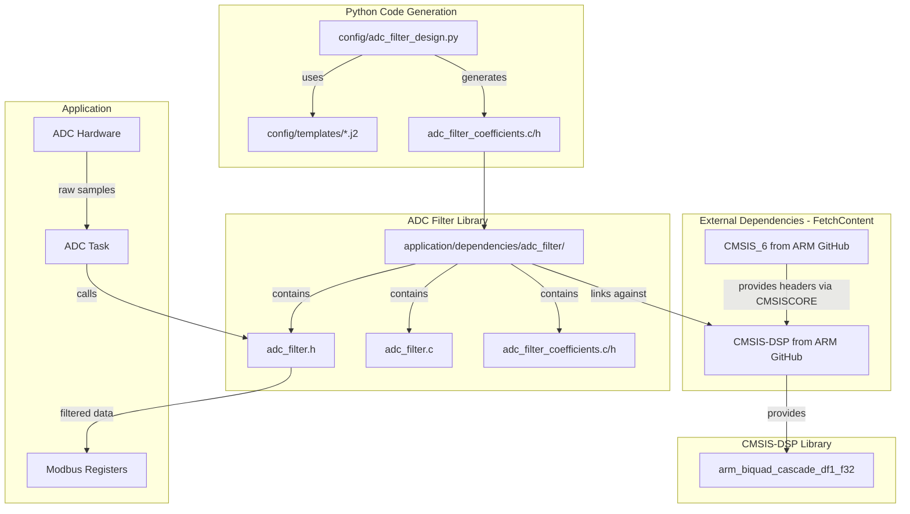
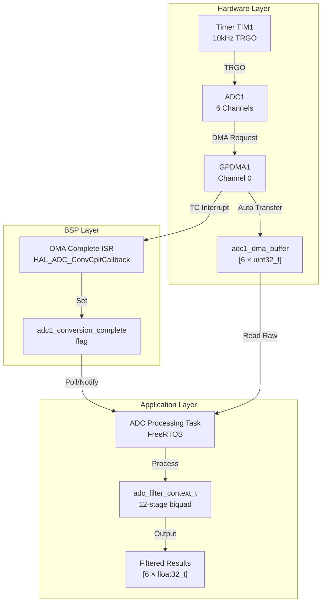
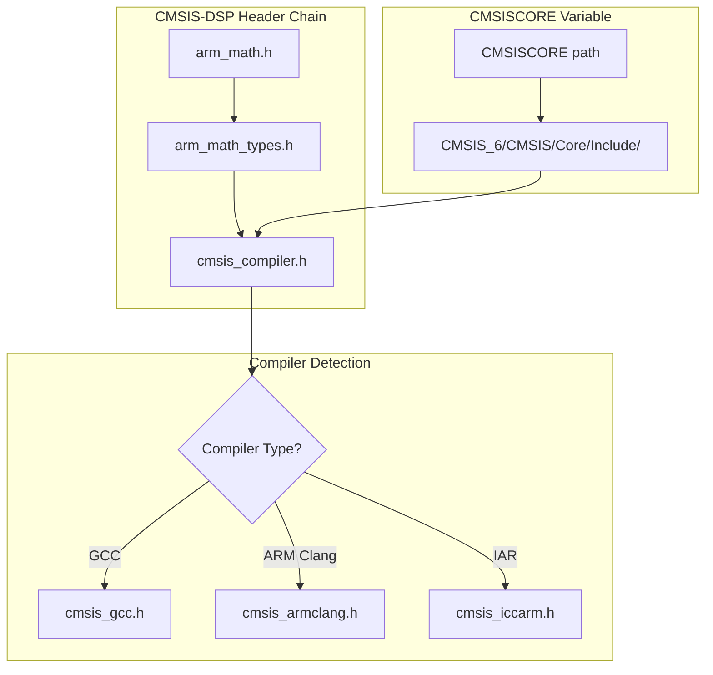
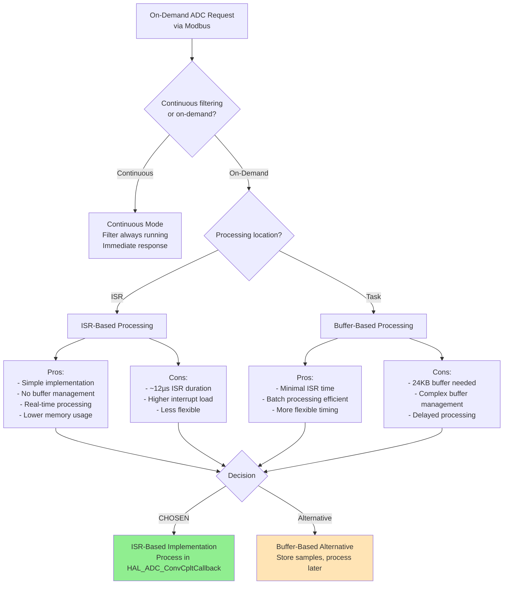
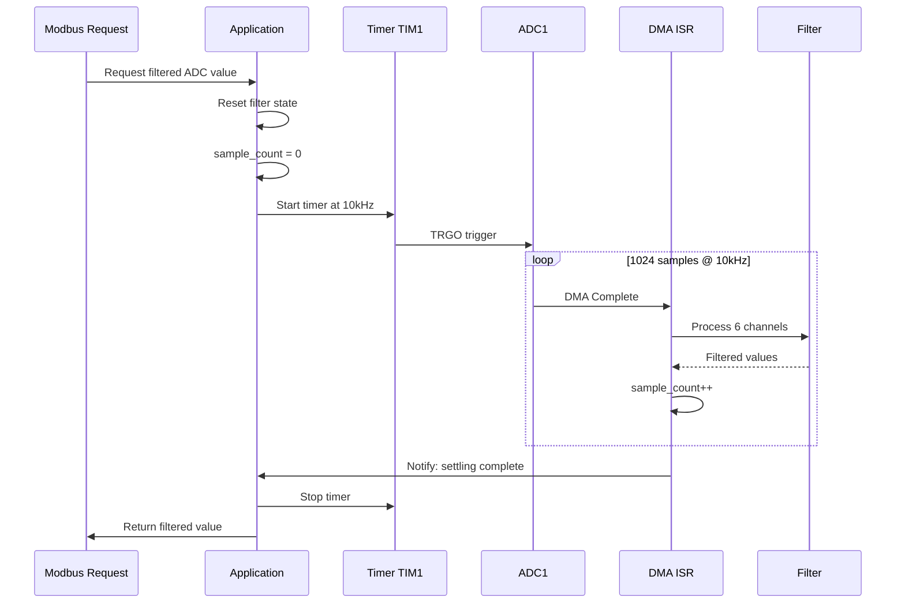
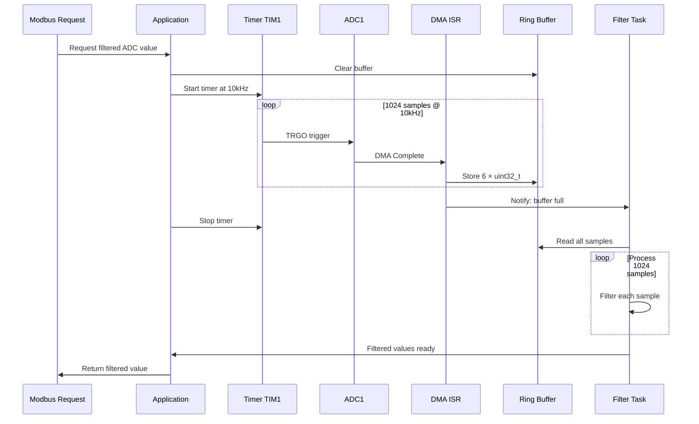

# ADC Filter Architecture Plan

## Overview

This document describes the architecture for implementing digital filtering on ADC inputs for the Jerry data acquisition firmware. The filter chain consists of a 4th order Butterworth low-pass filter with 500Hz cutoff and 10 IIR notch filters to reject 50Hz mains frequency and its harmonics.

## Design Specifications

| Parameter | Value |
|-----------|-------|
| Sampling Rate | 10 kHz |
| Number of ADC Channels | 6 |
| LPF Type | 4th order Butterworth |
| LPF Cutoff Frequency | 500 Hz |
| Notch Frequencies | 50, 100, 150, 200, 250, 300, 350, 400, 450, 500 Hz |
| Total Biquad Sections | 12 per channel (2 LPF + 10 notch) |

## Hardware Configuration (STM32H563)

### System Clock Configuration

From [`SystemClock_Config()`](application/bsp/stm/stm32h563/NonSecure/Core/Src/main.c:124):

| Parameter | Value |
|-----------|-------|
| HSE | 8 MHz (bypass digital) |
| PLL Configuration | M=4, N=250, P=2 |
| SYSCLK | 250 MHz |
| AHB/APB1/APB2/APB3 | 250 MHz (no division) |

### ADC1 Configuration

From [`MX_ADC1_Init()`](application/bsp/stm/stm32h563/NonSecure/Core/Src/main.c:186):

| Parameter | Current Value | Timer-Triggered Value |
|-----------|---------------|----------------------|
| Clock Source | `ADC_CLOCK_ASYNC_DIV4` | `ADC_CLOCK_ASYNC_DIV4` |
| ADC Clock | 16 MHz (64 MHz HSI / 4) | 16 MHz |
| Resolution | 12-bit | 12-bit |
| Sampling Time | 24.5 cycles | 24.5 cycles |
| Continuous Mode | **ENABLE** | **DISABLE** |
| External Trigger | Software Start | **Timer TRGO** |
| DMA Requests | ENABLE | ENABLE |
| Number of Channels | 6 | 6 |

### ADC Channels Configured

| Rank | Channel | Sampling Time |
|------|---------|---------------|
| 1 | ADC_CHANNEL_2 | 24.5 cycles |
| 2 | ADC_CHANNEL_3 | 24.5 cycles |
| 3 | ADC_CHANNEL_5 | 24.5 cycles |
| 4 | ADC_CHANNEL_10 | 24.5 cycles |
| 5 | ADC_CHANNEL_12 | 24.5 cycles |
| 6 | ADC_CHANNEL_13 | 24.5 cycles |

## Timing Analysis for 10 kHz Timer Trigger

### ADC Conversion Time Calculation

**Per-channel conversion time:**
```
T_conv = T_sampling + T_sar
T_conv = 24.5 cycles + 12.5 cycles = 37 ADC clock cycles
```

**Time per channel at 16 MHz ADC clock:**
```
T_channel = 37 / 16,000,000 = 2.3125 µs
```

**Total sequence time for 6 channels:**
```
T_sequence = 6 × 2.3125 µs = 13.875 µs ≈ 14 µs
```

### Filter Processing Time Estimation

**CMSIS-DSP `arm_biquad_cascade_df1_f32` Performance:**

Each biquad stage requires approximately:
- **10 multiply-accumulate (MAC) operations** per sample
- On Cortex-M33 (STM32H5) at 250 MHz with FPU: ~**4 cycles per MAC**

**Per-sample calculation:**
```
Cycles per stage = 10 MACs × 4 cycles = 40 cycles
Total cycles per sample = 12 stages × 40 cycles = 480 cycles
Time per sample = 480 / 250,000,000 = 1.92 µs
```

**For 6 ADC channels:**
```
Total filter time = 6 channels × 1.92 µs = 11.52 µs ≈ 12 µs
```

### Complete Timing Budget at 10 kHz

| Operation | Time | Cumulative |
|-----------|------|------------|
| Timer trigger period | 100 µs | - |
| ADC conversion (6 ch) | 14 µs | 14 µs |
| DMA transfer | ~0.5 µs | 14.5 µs |
| Filter processing (6 ch) | 12 µs | 26.5 µs |
| **Remaining margin** | **73.5 µs** | 100 µs |

### Overlap Analysis

**Will there be overlap at 10 kHz?**

**NO - There will NOT be overlap.**

```
ADC sequence time:  14 µs
Timer period:      100 µs
Margin:            86 µs (plenty of headroom)
```



```mermaid
gantt
    title ADC Timing at 10kHz Timer Trigger
    dateFormat X
    axisFormat %L µs

    section Timer Period 1
    ADC Conversion 6ch :0, 14
    Idle Time          :14, 100

    section Timer Period 2
    ADC Conversion 6ch :100, 114
    Idle Time          :114, 200
```

### Maximum Safe Trigger Frequencies

| Trigger Rate | Sequence Time | Period | Overlap Risk | Verdict |
|-------------|---------------|--------|--------------|---------|
| 10 kHz | 14 µs | 100 µs | **No** (86 µs margin) | ✅ Safe |
| 25 kHz | 14 µs | 40 µs | **No** (26 µs margin) | ✅ Safe |
| 50 kHz | 14 µs | 20 µs | **No** (6 µs margin) | ⚠️ Marginal |
| 71 kHz | 14 µs | 14 µs | **Yes** | ❌ Overlap |

## Computational Complexity

| Metric | Value |
|--------|-------|
| Operations per sample | 12 sections × 5 MACs = 60 MACs |
| Operations per second (1 channel) | 60 × 10,000 = 600,000 MACs/s |
| Operations per second (6 channels) | 3.6 million MACs/s |
| CPU Usage at 250MHz | ~2.5% |
| Coefficient Memory | 12 × 5 × 4 bytes = 240 bytes (shared) |
| State Memory per channel | 12 × 4 × 4 bytes = 192 bytes |
| Total State Memory (6 channels) | 1,152 bytes |

## Architecture

### Component Diagram



### Filter Signal Flow


## Directory Structure

```
application/
├── CMakeLists.txt              # Main build config with FetchContent for CMSIS
├── dependencies/
│   ├── CMSIS_6/                # Downloaded via FetchContent (git-ignored)
│   │   └── CMSIS/
│   │       └── Core/
│   │           └── Include/    # Core headers (cmsis_compiler.h, etc.)
│   ├── CMSIS-DSP/              # Downloaded via FetchContent (git-ignored)
│   │   ├── Include/            # DSP headers (arm_math.h, etc.)
│   │   └── Source/             # DSP source files (776 files)
│   └── adc_filter/
│       ├── CMakeLists.txt
│       ├── inc/
│       │   ├── adc_filter.h
│       │   └── adc_filter_coefficients.h
│       └── src/
│           ├── adc_filter.c
│           └── adc_filter_coefficients.c
config/
├── adc_filter_design.py
└── templates/
    ├── adc_filter_coefficients.c.j2
    └── adc_filter_coefficients.h.j2
```

## Python Filter Design Script

### Location
`config/adc_filter_design.py`

### Responsibilities
1. Design 4th order Butterworth LPF using scipy.signal
2. Design 10 IIR notch filters using scipy.signal.iirnotch
3. Convert filter coefficients to second-order sections (SOS) format
4. Generate C header and source files with coefficients in CMSIS-DSP format

### Output Files
- `application/dependencies/adc_filter/inc/adc_filter_coefficients.h`
- `application/dependencies/adc_filter/src/adc_filter_coefficients.c`

### Coefficient Format for CMSIS-DSP
Each biquad section requires 5 coefficients in order: `{b0, b1, b2, a1, a2}`

Note: CMSIS-DSP uses negated `a1` and `a2` coefficients compared to standard notation.

### Example Generated Code Structure

```c
// adc_filter_coefficients.h
#ifndef ADC_FILTER_COEFFICIENTS_H
#define ADC_FILTER_COEFFICIENTS_H

#include "arm_math.h"

#define ADC_FILTER_NUM_STAGES 12

extern const float32_t adc_filter_coefficients[ADC_FILTER_NUM_STAGES * 5];

#endif
```

```c
// adc_filter_coefficients.c
#include "adc_filter_coefficients.h"

const float32_t adc_filter_coefficients[ADC_FILTER_NUM_STAGES * 5] = {
    // LPF Stage 1: b0, b1, b2, -a1, -a2
    0.0f, 0.0f, 0.0f, 0.0f, 0.0f,
    // LPF Stage 2: b0, b1, b2, -a1, -a2
    0.0f, 0.0f, 0.0f, 0.0f, 0.0f,
    // Notch 50Hz: b0, b1, b2, -a1, -a2
    0.0f, 0.0f, 0.0f, 0.0f, 0.0f,
    // ... remaining notch filters
};
```

## C Filter Library API

### Header File: adc_filter.h

```c
#ifndef ADC_FILTER_H
#define ADC_FILTER_H

#include "arm_math.h"
#include <stdint.h>
#include <stdbool.h>

#define ADC_FILTER_NUM_CHANNELS     6   // Must match BSP_ADC1_NUM_CHANNELS
#define ADC_FILTER_NUM_STAGES       12
#define ADC_FILTER_STATE_SIZE       (ADC_FILTER_NUM_STAGES * 4)

// Filter instance for a single channel
typedef struct {
    arm_biquad_casd_df1_inst_f32 instance;
    float32_t state[ADC_FILTER_STATE_SIZE];
    bool initialized;
} adc_filter_channel_t;

// Filter context for all channels
typedef struct {
    adc_filter_channel_t channels[ADC_FILTER_NUM_CHANNELS];
} adc_filter_context_t;

// Initialize all filter channels
void adc_filter_init(adc_filter_context_t *ctx);

// Process a single sample for one channel
float32_t adc_filter_process_sample(adc_filter_context_t *ctx,
                                     uint8_t channel,
                                     float32_t input);

// Process a block of samples for one channel
void adc_filter_process_block(adc_filter_context_t *ctx,
                               uint8_t channel,
                               const float32_t *input,
                               float32_t *output,
                               uint32_t block_size);

// Reset filter state for a channel
void adc_filter_reset(adc_filter_context_t *ctx, uint8_t channel);

// Reset all filter states
void adc_filter_reset_all(adc_filter_context_t *ctx);

#endif
```

> **⚠️ IMPORTANT**: The current [`adc_filter.h`](application/dependencies/adc_filter/inc/adc_filter.h:41) defines `ADC_FILTER_NUM_CHANNELS` as 4, but the ADC has 6 channels. This must be updated to 6 to match [`BSP_ADC1_NUM_CHANNELS`](application/bsp/bsp.h:23).

### Implementation: adc_filter.c

Key implementation details:
1. Static allocation of all filter state variables
2. Shared coefficients across all channels
3. Per-channel state variables for independent filtering
4. Support for both sample-by-sample and block processing

## CMake Integration

### Filter Library CMakeLists.txt

```cmake
# application/dependencies/adc_filter/CMakeLists.txt

add_library(adc_filter STATIC
    src/adc_filter.c
    src/adc_filter_coefficients.c
)

target_include_directories(adc_filter
    PUBLIC
        ${CMAKE_CURRENT_SOURCE_DIR}/inc
)

target_link_libraries(adc_filter
    PUBLIC
        CMSIS_DSP
)
```

### Application CMakeLists.txt Integration

Add to `application/CMakeLists.txt`:
```cmake
add_subdirectory(dependencies/adc_filter)

target_link_libraries(${PROJECT_NAME}
    PRIVATE
        adc_filter
)
```

## Timer-Triggered ADC Integration

### System Architecture



### Required Code Changes

#### 1. Timer Configuration for 10 kHz Trigger

Add to [`main.c`](application/bsp/stm/stm32h563/NonSecure/Core/Src/main.c):

```c
TIM_HandleTypeDef htim1;

void MX_TIM1_Init(void)
{
    TIM_MasterConfigTypeDef sMasterConfig = {0};

    htim1.Instance = TIM1;
    htim1.Init.Prescaler = 249;           // 250 MHz / 250 = 1 MHz timer clock
    htim1.Init.CounterMode = TIM_COUNTERMODE_UP;
    htim1.Init.Period = 99;               // 1 MHz / 100 = 10 kHz
    htim1.Init.ClockDivision = TIM_CLOCKDIVISION_DIV1;
    htim1.Init.RepetitionCounter = 0;
    htim1.Init.AutoReloadPreload = TIM_AUTORELOAD_PRELOAD_DISABLE;

    if (HAL_TIM_Base_Init(&htim1) != HAL_OK)
    {
        Error_Handler();
    }

    /* Configure TRGO for ADC trigger */
    sMasterConfig.MasterOutputTrigger = TIM_TRGO_UPDATE;
    sMasterConfig.MasterSlaveMode = TIM_MASTERSLAVEMODE_DISABLE;

    if (HAL_TIMEx_MasterConfigSynchronization(&htim1, &sMasterConfig) != HAL_OK)
    {
        Error_Handler();
    }
}
```

#### 2. ADC Configuration Changes

Modify [`MX_ADC1_Init()`](application/bsp/stm/stm32h563/NonSecure/Core/Src/main.c:186):

```c
void MX_ADC1_Init(void)
{
    // ... existing code ...

    hadc1.Init.ContinuousConvMode = DISABLE;  // Changed from ENABLE
    hadc1.Init.ExternalTrigConv = ADC_EXTERNALTRIG_T1_TRGO;  // Timer 1 trigger
    hadc1.Init.ExternalTrigConvEdge = ADC_EXTERNALTRIGCONVEDGE_RISING;

    // ... rest of configuration ...
}
```

#### 3. BSP Start Function Update

Modify [`BSP_ADC1_Start()`](application/bsp/stm/bsp.c:130) to start the timer:

```c
bsp_error_t BSP_ADC1_Start(void)
{
    // ... existing DMA setup code ...

    /* Start ADC with DMA */
    if (ret == BSP_OK)
    {
        if (HAL_ADC_Start_DMA(&hadc1, adc1_dma_buffer, BSP_ADC1_NUM_CHANNELS) !=
            HAL_OK)
        {
            ret = BSP_ERROR;
        }
        else
        {
            adc1_running = true;

            /* Start timer to trigger ADC conversions at 10 kHz */
            HAL_TIM_Base_Start(&htim1);
        }
    }

    return ret;
}
```

### ADC Processing Task Implementation

Create a new file `application/src/adc_task.c`:

```c
#include "FreeRTOS.h"
#include "task.h"
#include "bsp.h"
#include "adc_filter.h"

/* Filter context - static allocation */
static adc_filter_context_t g_adc_filter_ctx;

/* Filtered results buffer */
static float32_t g_filtered_adc[BSP_ADC1_NUM_CHANNELS];

/* Raw ADC buffer for snapshot */
static uint32_t g_raw_adc[BSP_ADC1_NUM_CHANNELS];

/**
 * @brief Get filtered ADC value for a channel
 * @param channel Channel index (0 to BSP_ADC1_NUM_CHANNELS-1)
 * @return Filtered ADC value (0.0 to 1.0 normalized)
 */
float32_t adc_task_get_filtered(uint8_t channel)
{
    if (channel >= BSP_ADC1_NUM_CHANNELS)
    {
        return 0.0f;
    }
    return g_filtered_adc[channel];
}

/**
 * @brief ADC processing task
 * @param pvParameters Task parameters (unused)
 */
void adc_processing_task(void *pvParameters)
{
    (void)pvParameters;

    /* Initialize filter */
    adc_filter_init(&g_adc_filter_ctx);

    /* Start ADC with timer trigger */
    if (BSP_ADC1_Start() != BSP_OK)
    {
        /* Handle error - could suspend task or retry */
        vTaskSuspend(NULL);
    }

    for (;;)
    {
        /* Wait for conversion complete */
        if (BSP_ADC1_IsConversionComplete())
        {
            /* Get consistent copy of raw ADC data */
            BSP_ADC1_GetResultsCopy(g_raw_adc);

            /* Apply filter to each channel */
            for (uint8_t ch = 0; ch < BSP_ADC1_NUM_CHANNELS; ch++)
            {
                /* Convert 12-bit ADC to float (0.0 to 1.0 range) */
                float32_t input = (float32_t)g_raw_adc[ch] / 4095.0f;

                /* Apply 12-stage biquad filter */
                g_filtered_adc[ch] = adc_filter_process_sample(
                    &g_adc_filter_ctx, ch, input);
            }
        }

        /* Yield to other tasks - check every 1ms */
        vTaskDelay(pdMS_TO_TICKS(1));
    }
}
```

### Alternative: Block Processing for Better Efficiency

For improved cache utilization and reduced function call overhead:

```c
#define FILTER_BLOCK_SIZE 10  // Process 10 samples at once (1ms worth at 10kHz)

static float32_t input_buffer[BSP_ADC1_NUM_CHANNELS][FILTER_BLOCK_SIZE];
static float32_t output_buffer[BSP_ADC1_NUM_CHANNELS][FILTER_BLOCK_SIZE];
static uint32_t sample_index = 0;

void process_adc_sample_block(uint32_t *raw_adc)
{
    /* Accumulate samples */
    for (uint8_t ch = 0; ch < BSP_ADC1_NUM_CHANNELS; ch++)
    {
        input_buffer[ch][sample_index] = (float32_t)raw_adc[ch] / 4095.0f;
    }
    sample_index++;

    /* Process block when full */
    if (sample_index >= FILTER_BLOCK_SIZE)
    {
        for (uint8_t ch = 0; ch < BSP_ADC1_NUM_CHANNELS; ch++)
        {
            adc_filter_process_block(&g_adc_filter_ctx, ch,
                input_buffer[ch], output_buffer[ch], FILTER_BLOCK_SIZE);

            /* Use latest filtered value */
            g_filtered_adc[ch] = output_buffer[ch][FILTER_BLOCK_SIZE - 1];
        }
        sample_index = 0;
    }
}
```

### Integration with Existing Code

Modify `application/src/peripheral_adapters.c` to include filtering:

```c
#include "adc_filter.h"

static adc_filter_context_t g_adc_filter_ctx;

void peripheral_adc_init(void) {
    // Initialize ADC hardware
    // ...

    // Initialize filters
    adc_filter_init(&g_adc_filter_ctx);
}

uint16_t peripheral_adc_read(uint8_t channel) {
    // Read raw ADC value
    uint16_t raw_value = /* HAL ADC read */;

    // Convert to float
    float32_t input = (float32_t)raw_value;

    // Apply filter
    float32_t filtered = adc_filter_process_sample(&g_adc_filter_ctx,
                                                    channel,
                                                    input);

    // Convert back to uint16_t
    return (uint16_t)filtered;
}
```

## Memory Layout

### Static Allocation Summary

| Component | Size | Notes |
|-----------|------|-------|
| Coefficients | 240 bytes | Shared across all channels |
| State Ch0 | 192 bytes | 12 stages × 4 state vars × 4 bytes |
| State Ch1 | 192 bytes | |
| State Ch2 | 192 bytes | |
| State Ch3 | 192 bytes | |
| State Ch4 | 192 bytes | |
| State Ch5 | 192 bytes | |
| Filter instances | 96 bytes | 6 × arm_biquad_casd_df1_inst_f32 |
| **Total** | **~1.5 KB** | |

## Implementation Checklist

### Phase 1: Python Script ✅ (Completed)
- [x] Create `config/adc_filter_design.py`
- [x] Implement Butterworth LPF design
- [x] Implement notch filter design for all harmonics
- [x] Generate C coefficient files
- [ ] Add unit tests for coefficient generation

### Phase 2: C Filter Library ✅ (Completed)
- [x] Create directory structure
- [x] Implement `adc_filter.h` API
- [x] Implement `adc_filter.c`
- [x] Create CMakeLists.txt
- [ ] Add unit tests for filter processing

### Phase 3: Timer-Triggered ADC Integration (Pending)
- [ ] Update `ADC_FILTER_NUM_CHANNELS` from 4 to 6 in [`adc_filter.h`](application/dependencies/adc_filter/inc/adc_filter.h:41)
- [ ] Add `MX_TIM1_Init()` for 10 kHz TRGO output
- [ ] Modify [`MX_ADC1_Init()`](application/bsp/stm/stm32h563/NonSecure/Core/Src/main.c:186) for timer trigger
- [ ] Update [`BSP_ADC1_Start()`](application/bsp/stm/bsp.c:130) to start timer
- [ ] Create ADC processing task with filter integration
- [ ] Update Modbus register mapping for filtered values
- [ ] Integration testing

### Phase 4: Validation
- [ ] Verify filter frequency response
- [ ] Measure actual CPU usage
- [ ] Test 50Hz rejection performance
- [ ] Validate with real ADC signals
- [ ] Verify no ADC conversion overlap at 10 kHz

## Dependencies

### Required
- CMSIS-DSP library (fetched from ARM GitHub via FetchContent)
- CMSIS_6 (fetched from ARM GitHub via FetchContent)
- Python 3.x with scipy, numpy, jinja2

### Python Dependencies
```
scipy>=1.7.0
numpy>=1.20.0
jinja2>=3.0.0
```

## CMSIS-DSP Integration Architecture

### Overview

The project uses the official ARM CMSIS-DSP library fetched directly from GitHub using CMake's FetchContent module. This approach ensures we always have access to the latest optimized DSP functions without relying on vendor-provided libraries.

### FetchContent Configuration

The CMSIS-DSP and CMSIS_6 repositories are fetched in [`application/CMakeLists.txt`](application/CMakeLists.txt):

```cmake
# Dependencies path
set(DEPS_PATH "${CMAKE_CURRENT_SOURCE_DIR}/dependencies")

# CMSIS-DSP Configuration (must be set BEFORE FetchContent_MakeAvailable)
set(ARM_CPU "cortex-m33" CACHE STRING "ARM CPU type")
set(CMSISCORE "${DEPS_PATH}/CMSIS_6/CMSIS/Core/Include" CACHE PATH "Path to CMSIS Core headers")

# FetchContent declarations
FetchContent_Declare(FCD_cmsis_6
    GIT_REPOSITORY https://github.com/ARM-software/CMSIS_6.git
    GIT_TAG        v6.1.0
    SOURCE_DIR     ${DEPS_PATH}/CMSIS_6
)

FetchContent_Declare(FCD_cmsis_dsp
    GIT_REPOSITORY https://github.com/ARM-software/CMSIS-DSP.git
    GIT_TAG        v1.16.2
    SOURCE_DIR     ${DEPS_PATH}/CMSIS-DSP
)

# Make dependencies available
FetchContent_MakeAvailable(FCD_cmsis_6 FCD_cmsis_dsp)

# Configure CMSISDSP target after FetchContent creates it
if(TARGET CMSISDSP)
    target_compile_definitions(CMSISDSP PUBLIC
        ARM_MATH_CM33
        ARM_MATH_LOOPUNROLL
    )
    target_include_directories(CMSISDSP PUBLIC
        ${CMSISCORE}
    )
endif()
```

### CMSISCORE Variable Mechanism

The key to making CMSIS-DSP work with CMSIS_6 is the `CMSISCORE` variable. This is how the integration works:



**Header Include Chain:**
1. [`arm_math.h`](application/dependencies/CMSIS-DSP/Include/arm_math.h) - Main CMSIS-DSP header
2. [`arm_math_types.h`](application/dependencies/CMSIS-DSP/Include/arm_math_types.h) - Type definitions
3. [`cmsis_compiler.h`](application/dependencies/CMSIS_6/CMSIS/Core/Include/cmsis_compiler.h) - Compiler abstraction (from CMSIS_6)
4. Compiler-specific headers (e.g., `cmsis_gcc.h`) - Intrinsics and optimizations

The `CMSISCORE` variable tells CMSIS-DSP where to find the CMSIS Core headers. Without this, the build would fail because `arm_math_types.h` includes `cmsis_compiler.h` which is part of CMSIS_6, not CMSIS-DSP.

### Build Configuration

**Critical Order of Operations:**
1. Set `CMSISCORE` variable **BEFORE** `FetchContent_MakeAvailable`
2. CMSIS-DSP's CMakeLists.txt reads `CMSISCORE` during configuration
3. After `FetchContent_MakeAvailable`, the `CMSISDSP` target exists
4. Additional compile definitions can be added to the target

**Compile Definitions:**
| Definition | Purpose |
|------------|---------|
| `ARM_MATH_CM33` | Enables Cortex-M33 optimizations |
| `ARM_MATH_LOOPUNROLL` | Enables loop unrolling for performance |

### Build Output

The full CMSIS-DSP library compilation produces:
- **776 object files** compiled from the Source directory
- **libCMSISDSP.a** static library (~2.5 MB)
- Includes all DSP functions: filtering, transforms, matrix operations, statistics, etc.

### ADC Filter Library Linkage

The [`adc_filter`](application/dependencies/adc_filter/CMakeLists.txt) library links against CMSISDSP:

```cmake
add_library(adc_filter STATIC
    ${CMAKE_CURRENT_SOURCE_DIR}/src/adc_filter.c
    ${CMAKE_CURRENT_SOURCE_DIR}/src/adc_filter_coefficients.c
)

target_include_directories(adc_filter
    PUBLIC
        ${CMAKE_CURRENT_SOURCE_DIR}/inc
)

target_link_libraries(adc_filter
    PUBLIC
        CMSISDSP
)
```

### Git Ignore Configuration

The fetched CMSIS repositories are excluded from version control in [`.gitignore`](.gitignore):

```gitignore
# CMSIS dependencies (fetched via FetchContent)
application/dependencies/CMSIS-DSP/
application/dependencies/CMSIS_6/
```

### Memory Impact

| Component | Size |
|-----------|------|
| libCMSISDSP.a (full library) | ~2.5 MB |
| Linked functions (after LTO) | ~10-20 KB |
| Filter coefficients | 240 bytes |
| Filter state (6 channels) | 1,152 bytes |

Note: The linker only includes functions that are actually used, so the final binary size impact is minimal despite compiling the full library.

## On-Demand Sampling Architecture

### Overview

The ADC filter system supports **on-demand sampling** where filtered ADC values are requested via Modbus or other interfaces. Rather than continuously filtering data, the system samples at 10kHz, processes through the filter, and returns the settled filtered value only when requested.

### Key Requirements

| Requirement | Value | Rationale |
|-------------|-------|-----------|
| Sampling Rate | 10 kHz | Filter designed for this rate |
| Filter Settling Time | ~1024 samples | 50Hz notch filters need ~20 cycles to settle |
| Settling Duration | 102.4 ms | 1024 samples ÷ 10kHz |
| Processing per Sample | ~12 µs | 6 channels × 2 µs per channel |

### Filter Settling Time Analysis

The 50Hz notch filter has the longest settling time in the filter chain:

```
Notch filter Q factor: ~30 (typical for sharp notch)
Settling time ≈ Q × (1 / notch_frequency) × cycles_to_settle
Settling time ≈ 30 × (1/50) × 1.7 ≈ 1.02 seconds for 99% settling

For 90% settling (acceptable for most applications):
Settling time ≈ 0.5 × Q × (1/50) ≈ 0.3 seconds = 3000 samples

Practical minimum (95% settling):
~1024 samples = 102.4 ms
```

### Architecture Decision Tree



### Option A: ISR-Based Processing (CHOSEN)

This is the **selected implementation** for on-demand ADC sampling.

#### Architecture



#### Implementation Details

**ISR Processing Time Budget:**

| Operation | Time | Notes |
|-----------|------|-------|
| ISR entry overhead | ~0.5 µs | Context save |
| Read DMA buffer | ~0.2 µs | 6 × uint32_t |
| Convert to float | ~0.5 µs | 6 channels |
| Filter processing | ~12 µs | 6 ch × 12 stages × ~170 cycles |
| Update counters | ~0.1 µs | |
| ISR exit overhead | ~0.5 µs | Context restore |
| **Total** | **~14 µs** | Well within 100 µs period |

**Code Structure:**

```c
// In bsp.c or adc_task.c

static adc_filter_context_t g_filter_ctx;
static volatile uint32_t g_sample_count = 0;
static volatile bool g_sampling_active = false;
static float32_t g_filtered_values[BSP_ADC1_NUM_CHANNELS];

#define ADC_SETTLING_SAMPLES 1024

void HAL_ADC_ConvCpltCallback(ADC_HandleTypeDef *hadc)
{
    if (hadc->Instance == ADC1 && g_sampling_active)
    {
        // Process each channel through filter
        for (uint8_t ch = 0; ch < BSP_ADC1_NUM_CHANNELS; ch++)
        {
            float32_t input = (float32_t)adc1_dma_buffer[ch] / 4095.0f;
            g_filtered_values[ch] = adc_filter_process_sample(
                &g_filter_ctx, ch, input);
        }

        g_sample_count++;

        if (g_sample_count >= ADC_SETTLING_SAMPLES)
        {
            // Stop sampling, notify waiting task
            HAL_TIM_Base_Stop(&htim1);
            g_sampling_active = false;
            // Signal completion via semaphore or event flag
        }
    }
}

// Called from Modbus handler or application task
bsp_error_t adc_get_filtered_value(uint8_t channel, float32_t *value)
{
    if (channel >= BSP_ADC1_NUM_CHANNELS || value == NULL)
    {
        return BSP_ERROR;
    }

    // Reset filter state for clean measurement
    adc_filter_reset_all(&g_filter_ctx);

    // Start sampling
    g_sample_count = 0;
    g_sampling_active = true;
    HAL_TIM_Base_Start(&htim1);

    // Wait for settling (with timeout)
    uint32_t timeout = 200; // 200ms timeout
    while (g_sampling_active && timeout > 0)
    {
        vTaskDelay(pdMS_TO_TICKS(1));
        timeout--;
    }

    if (g_sampling_active)
    {
        // Timeout - stop and return error
        HAL_TIM_Base_Stop(&htim1);
        g_sampling_active = false;
        return BSP_ERROR;
    }

    *value = g_filtered_values[channel];
    return BSP_OK;
}
```

#### Advantages of ISR-Based Approach

1. **Simple Implementation**: No complex buffer management
2. **Low Memory**: Only filter state (~1.5KB) needed
3. **Real-Time**: Each sample processed immediately
4. **Deterministic**: Fixed processing time per sample

#### Limitations

1. **ISR Duration**: ~14µs per conversion (acceptable at 10kHz)
2. **CPU Load**: ~14% during sampling (14µs / 100µs)
3. **Blocking**: Request blocks for ~102ms during settling

### Option B: Buffer-Based Processing (Alternative)

This approach stores raw samples in a circular buffer and processes them in a FreeRTOS task.

#### Architecture



#### Memory Requirements

| Component | Size | Calculation |
|-----------|------|-------------|
| Ring buffer | 24,576 bytes | 1024 samples × 6 channels × 4 bytes |
| Filter state | 1,152 bytes | 6 channels × 192 bytes |
| Output buffer | 24 bytes | 6 channels × 4 bytes |
| **Total** | **~25 KB** | |

#### Implementation Sketch

```c
#define BUFFER_SAMPLES 1024
#define NUM_CHANNELS 6

static uint32_t g_sample_buffer[BUFFER_SAMPLES][NUM_CHANNELS];
static volatile uint32_t g_write_index = 0;
static volatile bool g_buffer_full = false;

void HAL_ADC_ConvCpltCallback(ADC_HandleTypeDef *hadc)
{
    if (hadc->Instance == ADC1 && !g_buffer_full)
    {
        // Just copy data - minimal ISR time (~0.5µs)
        memcpy(g_sample_buffer[g_write_index],
               adc1_dma_buffer,
               sizeof(uint32_t) * NUM_CHANNELS);

        g_write_index++;

        if (g_write_index >= BUFFER_SAMPLES)
        {
            g_buffer_full = true;
            HAL_TIM_Base_Stop(&htim1);
            // Notify filter task
        }
    }
}

void filter_task(void *pvParameters)
{
    for (;;)
    {
        // Wait for buffer full notification
        ulTaskNotifyTake(pdTRUE, portMAX_DELAY);

        // Process all samples through filter
        for (uint32_t i = 0; i < BUFFER_SAMPLES; i++)
        {
            for (uint8_t ch = 0; ch < NUM_CHANNELS; ch++)
            {
                float32_t input = (float32_t)g_sample_buffer[i][ch] / 4095.0f;
                g_filtered_values[ch] = adc_filter_process_sample(
                    &g_filter_ctx, ch, input);
            }
        }

        // Notify application that values are ready
    }
}
```

#### When to Use Buffer-Based Approach

Consider this alternative if:
- ISR duration becomes a concern (e.g., higher sample rates)
- Need to process samples with different algorithms
- Want to log raw samples for debugging
- Memory is not constrained

### Comparison Summary

| Aspect | ISR-Based (Chosen) | Buffer-Based |
|--------|-------------------|--------------|
| ISR Duration | ~14 µs | ~0.5 µs |
| Memory Usage | ~1.5 KB | ~25 KB |
| Implementation | Simple | Complex |
| Flexibility | Lower | Higher |
| Latency | Real-time | Batch delay |
| CPU Load (during sampling) | ~14% | ~0.5% ISR + task |

### Decision Rationale

**ISR-Based Processing was chosen because:**

1. **Sufficient Timing Margin**: 14µs ISR fits easily in 100µs period (86µs margin)
2. **Memory Efficiency**: 1.5KB vs 25KB is significant on embedded systems
3. **Simpler Code**: No ring buffer management, no task synchronization
4. **Proven Pattern**: Similar to existing DMA callback structure in [`bsp.c`](application/bsp/stm/bsp.c)

The buffer-based approach remains documented as a viable alternative if requirements change (e.g., higher sample rates, need for raw data logging).

## Notes

1. **Coefficient Ordering**: CMSIS-DSP expects coefficients in the order `{b0, b1, b2, -a1, -a2}`. The Python script must negate `a1` and `a2` when generating coefficients.

2. **Numerical Stability**: Using cascaded biquad sections ensures numerical stability compared to higher-order direct implementations.

3. **Per-Channel Flexibility**: While all channels use the same coefficients by default, the architecture allows for per-channel coefficient customization if needed in the future.

4. **Block Processing**: For efficiency, consider processing samples in blocks when possible, as CMSIS-DSP is optimized for block operations.
