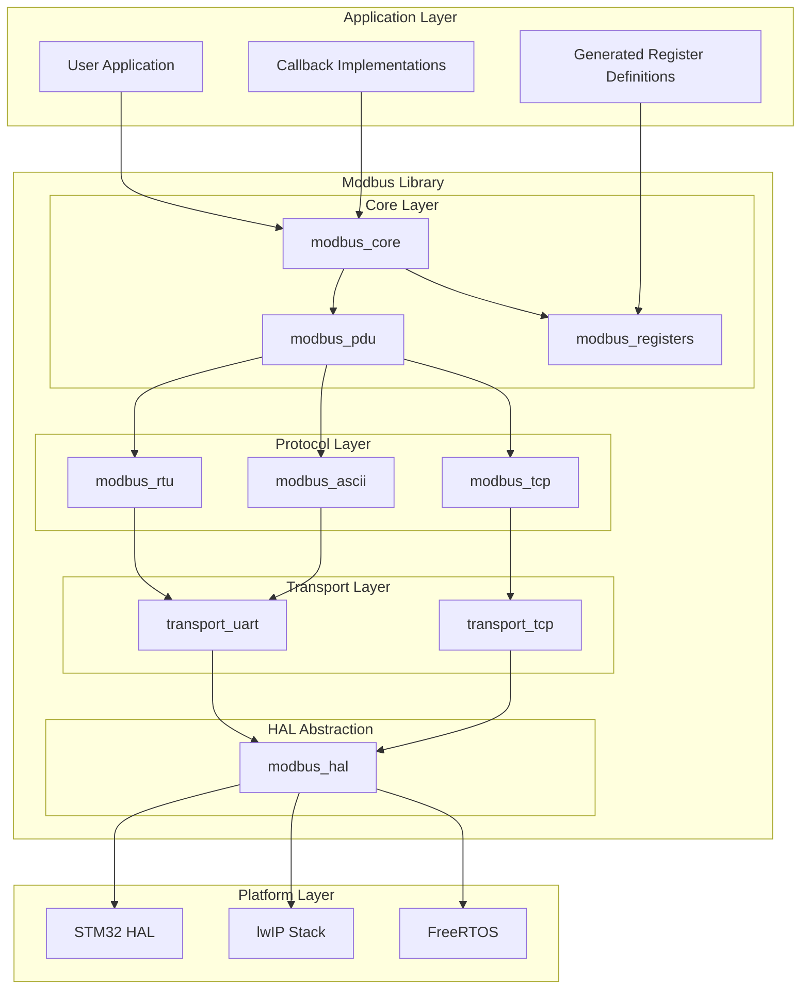
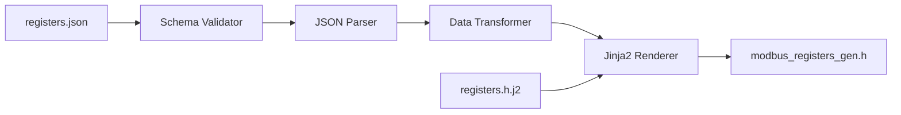

# Custom Modbus Library Architecture Plan

## Overview

This document outlines the architecture for a custom Modbus library designed for STM32 Nucleo-H563 board supporting RTU, ASCII, and TCP/IP protocols. The library follows SOLID principles, uses pure C implementation, and integrates with FreeRTOS without dynamic memory allocation.

## Table of Contents

1. [Requirements Summary](#requirements-summary)
2. [Architecture Overview](#architecture-overview)
3. [Directory Structure](#directory-structure)
4. [Module Design](#module-design)
5. [JSON Configuration Schema](#json-configuration-schema)
6. [Code Generation Tool](#code-generation-tool)
7. [Callback System Design](#callback-system-design)
8. [Memory Management](#memory-management)
9. [Implementation Phases](#implementation-phases)

---

## Requirements Summary

### Functional Requirements
- **Protocol Support**: Modbus RTU, ASCII, TCP/IP
- **Mode Support**: Master and Slave modes
- **Register Types**: Coils, Discrete Inputs, Holding Registers, Input Registers
- **Function Codes**: FC01-FC06, FC15, FC16 (standard read/write operations)

### Non-Functional Requirements
- Pure C implementation (no C++)
- No dynamic memory allocation
- FreeRTOS compatible with static allocation
- SOLID principles compliance
- Callback-based architecture
- JSON-driven register configuration
- Google C++ Coding Style compliance

### Hardware Requirements
- Modbus RTU: UART at 19200bps, 2 stop bits, no parity
- Modbus TCP/IP: lwIP stack, port 502
- STM32H563 HAL integration

---

## Architecture Overview

### High-Level Architecture Diagram



### SOLID Principles Application

| Principle | Application |
|-----------|-------------|
| **Single Responsibility** | Each module handles one specific function: PDU processing, CRC calculation, transport, etc. |
| **Open/Closed** | Protocol implementations extend base interfaces without modifying core logic |
| **Liskov Substitution** | RTU, ASCII, TCP protocols are interchangeable through common interface |
| **Interface Segregation** | Separate interfaces for transport, protocol, and application callbacks |
| **Dependency Inversion** | Core depends on abstract transport interface, not concrete implementations |

---

## Directory Structure

```
application/
├── dependencies/
│   └── modbus/                          # Custom Modbus library
│       ├── CMakeLists.txt               # Library build configuration
│       ├── inc/                         # Public headers
│       │   ├── modbus.h                 # Main public API
│       │   ├── modbus_types.h           # Type definitions
│       │   ├── modbus_config.h          # Configuration options
│       │   └── modbus_callbacks.h       # Callback declarations
│       ├── src/                         # Implementation
│       │   ├── core/                    # Core functionality
│       │   │   ├── modbus_core.c        # Main state machine
│       │   │   ├── modbus_pdu.c         # PDU encoding/decoding
│       │   │   └── modbus_registers.c   # Register management
│       │   ├── protocol/                # Protocol implementations
│       │   │   ├── modbus_rtu.c         # RTU framing
│       │   │   ├── modbus_ascii.c       # ASCII framing
│       │   │   └── modbus_tcp.c         # TCP/IP framing
│       │   ├── transport/               # Transport layer
│       │   │   ├── transport_uart.c     # UART transport
│       │   │   └── transport_tcp.c      # TCP transport
│       │   └── util/                    # Utilities
│       │       ├── modbus_crc.c         # CRC-16 calculation
│       │       └── modbus_lrc.c         # LRC calculation
│       ├── port/                        # Platform-specific ports
│       │   └── stm32h5/                 # STM32H5 port
│       │       ├── modbus_hal_stm32.c   # HAL implementation
│       │       └── modbus_hal_stm32.h   # HAL header
│       └── config/                      # Configuration templates
│           └── modbus_config_template.h # Config template
│
├── config/
│   └── modbus/
│       └── registers.json               # Register definitions
│
├── generated/
│   └── modbus_registers_gen.h           # Generated register header
│
└── src/
    └── modbus_callbacks.c               # User callback implementations

tools/
└── modbus_codegen/                      # Code generation tool
    ├── __init__.py
    ├── codegen.py                       # Main generator script
    ├── schema.py                        # JSON schema validation
    └── templates/
        └── registers.h.j2               # Jinja2 template
```

---

## Module Design

### 1. Core Layer

#### modbus_types.h - Type Definitions
```c
/* Modbus protocol modes */
typedef enum {
    MODBUS_MODE_SLAVE = 0,
    MODBUS_MODE_MASTER
} modbus_mode_t;

/* Modbus protocol types */
typedef enum {
    MODBUS_PROTOCOL_RTU = 0,
    MODBUS_PROTOCOL_ASCII,
    MODBUS_PROTOCOL_TCP
} modbus_protocol_t;

/* Modbus function codes */
typedef enum {
    MODBUS_FC_READ_COILS              = 0x01,
    MODBUS_FC_READ_DISCRETE_INPUTS    = 0x02,
    MODBUS_FC_READ_HOLDING_REGISTERS  = 0x03,
    MODBUS_FC_READ_INPUT_REGISTERS    = 0x04,
    MODBUS_FC_WRITE_SINGLE_COIL       = 0x05,
    MODBUS_FC_WRITE_SINGLE_REGISTER   = 0x06,
    MODBUS_FC_WRITE_MULTIPLE_COILS    = 0x0F,
    MODBUS_FC_WRITE_MULTIPLE_REGISTERS = 0x10
} modbus_function_code_t;

/* Modbus exception codes */
typedef enum {
    MODBUS_EXCEPTION_NONE                    = 0x00,
    MODBUS_EXCEPTION_ILLEGAL_FUNCTION        = 0x01,
    MODBUS_EXCEPTION_ILLEGAL_DATA_ADDRESS    = 0x02,
    MODBUS_EXCEPTION_ILLEGAL_DATA_VALUE      = 0x03,
    MODBUS_EXCEPTION_SLAVE_DEVICE_FAILURE    = 0x04,
    MODBUS_EXCEPTION_ACKNOWLEDGE             = 0x05,
    MODBUS_EXCEPTION_SLAVE_DEVICE_BUSY       = 0x06
} modbus_exception_t;

/* Modbus error codes */
typedef enum {
    MODBUS_OK = 0,
    MODBUS_ERROR_INVALID_PARAM,
    MODBUS_ERROR_TIMEOUT,
    MODBUS_ERROR_CRC,
    MODBUS_ERROR_FRAME,
    MODBUS_ERROR_TRANSPORT,
    MODBUS_ERROR_BUFFER_OVERFLOW
} modbus_error_t;

/* PDU structure - protocol independent */
typedef struct {
    uint8_t function_code;
    uint8_t data[MODBUS_MAX_PDU_SIZE];
    uint16_t data_length;
} modbus_pdu_t;

/* ADU structure - includes address and protocol-specific framing */
typedef struct {
    uint8_t unit_id;
    modbus_pdu_t pdu;
    uint16_t transaction_id;  /* TCP only */
} modbus_adu_t;
```

#### modbus_core.h - Core API
```c
/* Forward declarations */
typedef struct modbus_context modbus_context_t;

/* Context configuration */
typedef struct {
    modbus_mode_t mode;
    modbus_protocol_t protocol;
    uint8_t unit_id;
    uint32_t response_timeout_ms;
    uint32_t inter_frame_delay_us;  /* RTU: 3.5 char times */
} modbus_config_t;

/* Initialize modbus context */
modbus_error_t modbus_init(modbus_context_t* ctx, const modbus_config_t* config);

/* Process incoming data - call from transport receive callback */
modbus_error_t modbus_process(modbus_context_t* ctx, const uint8_t* data, uint16_t length);

/* Poll for timeout handling - call periodically */
modbus_error_t modbus_poll(modbus_context_t* ctx);

/* Master mode: Send request */
modbus_error_t modbus_master_request(modbus_context_t* ctx, const modbus_adu_t* request);

/* Get last error */
modbus_exception_t modbus_get_last_exception(const modbus_context_t* ctx);
```

### 2. Protocol Layer

#### Protocol Interface - Abstract Interface
```c
/* Protocol operations interface */
typedef struct {
    /* Encode PDU to protocol-specific frame */
    modbus_error_t (*encode)(const modbus_adu_t* adu, uint8_t* buffer,
                             uint16_t buffer_size, uint16_t* frame_length);

    /* Decode protocol-specific frame to PDU */
    modbus_error_t (*decode)(const uint8_t* buffer, uint16_t length,
                             modbus_adu_t* adu);

    /* Validate frame integrity */
    modbus_error_t (*validate)(const uint8_t* buffer, uint16_t length);

    /* Get minimum frame size */
    uint16_t (*get_min_frame_size)(void);
} modbus_protocol_ops_t;

/* Protocol implementations */
extern const modbus_protocol_ops_t modbus_rtu_ops;
extern const modbus_protocol_ops_t modbus_ascii_ops;
extern const modbus_protocol_ops_t modbus_tcp_ops;
```

### 3. Transport Layer

#### Transport Interface - Abstract Interface
```c
/* Transport operations interface */
typedef struct {
    /* Initialize transport */
    modbus_error_t (*init)(void* handle, const void* config);

    /* Send data */
    modbus_error_t (*send)(void* handle, const uint8_t* data, uint16_t length);

    /* Receive data - non-blocking */
    modbus_error_t (*receive)(void* handle, uint8_t* buffer,
                              uint16_t buffer_size, uint16_t* received);

    /* Close transport */
    modbus_error_t (*close)(void* handle);

    /* Get transport status */
    bool (*is_connected)(void* handle);
} modbus_transport_ops_t;

/* Transport implementations */
extern const modbus_transport_ops_t modbus_uart_transport_ops;
extern const modbus_transport_ops_t modbus_tcp_transport_ops;
```

### 4. HAL Abstraction Layer

```c
/* HAL interface for platform abstraction */
typedef struct {
    /* Timing functions */
    uint32_t (*get_tick_ms)(void);
    void (*delay_us)(uint32_t us);

    /* UART functions */
    modbus_error_t (*uart_init)(uint32_t baudrate, uint8_t stop_bits, uint8_t parity);
    modbus_error_t (*uart_send)(const uint8_t* data, uint16_t length);
    modbus_error_t (*uart_receive)(uint8_t* buffer, uint16_t size, uint16_t* received);

    /* TCP functions - uses lwIP */
    modbus_error_t (*tcp_listen)(uint16_t port);
    modbus_error_t (*tcp_accept)(int* client_socket);
    modbus_error_t (*tcp_send)(int socket, const uint8_t* data, uint16_t length);
    modbus_error_t (*tcp_receive)(int socket, uint8_t* buffer, uint16_t size, uint16_t* received);
    modbus_error_t (*tcp_close)(int socket);
} modbus_hal_t;

/* Platform-specific HAL implementation */
extern const modbus_hal_t modbus_hal_stm32h5;
```

---

## JSON Configuration Schema

### Schema Definition

```json
{
  "$schema": "http://json-schema.org/draft-07/schema#",
  "title": "Modbus Register Configuration",
  "type": "object",
  "required": ["version", "device", "registers"],
  "properties": {
    "version": {
      "type": "string",
      "pattern": "^[0-9]+\\.[0-9]+$"
    },
    "device": {
      "type": "object",
      "required": ["name", "unit_id"],
      "properties": {
        "name": { "type": "string" },
        "unit_id": { "type": "integer", "minimum": 1, "maximum": 247 },
        "description": { "type": "string" }
      }
    },
    "registers": {
      "type": "object",
      "properties": {
        "coils": {
          "type": "array",
          "items": { "$ref": "#/definitions/coil_register" }
        },
        "discrete_inputs": {
          "type": "array",
          "items": { "$ref": "#/definitions/discrete_register" }
        },
        "holding_registers": {
          "type": "array",
          "items": { "$ref": "#/definitions/holding_register" }
        },
        "input_registers": {
          "type": "array",
          "items": { "$ref": "#/definitions/input_register" }
        }
      }
    }
  },
  "definitions": {
    "coil_register": {
      "type": "object",
      "required": ["name", "address"],
      "properties": {
        "name": { "type": "string", "pattern": "^[A-Z][A-Z0-9_]*$" },
        "address": { "type": "integer", "minimum": 0, "maximum": 65535 },
        "description": { "type": "string" },
        "default_value": { "type": "boolean", "default": false }
      }
    },
    "discrete_register": {
      "type": "object",
      "required": ["name", "address"],
      "properties": {
        "name": { "type": "string", "pattern": "^[A-Z][A-Z0-9_]*$" },
        "address": { "type": "integer", "minimum": 0, "maximum": 65535 },
        "description": { "type": "string" }
      }
    },
    "holding_register": {
      "type": "object",
      "required": ["name", "address", "data_type"],
      "properties": {
        "name": { "type": "string", "pattern": "^[A-Z][A-Z0-9_]*$" },
        "address": { "type": "integer", "minimum": 0, "maximum": 65535 },
        "data_type": {
          "type": "string",
          "enum": ["uint16", "int16", "uint32", "int32", "float32"]
        },
        "description": { "type": "string" },
        "min_value": { "type": "number" },
        "max_value": { "type": "number" },
        "default_value": { "type": "number", "default": 0 },
        "scale_factor": { "type": "number", "default": 1.0 },
        "unit": { "type": "string" },
        "access": {
          "type": "string",
          "enum": ["read_only", "read_write"],
          "default": "read_write"
        }
      }
    },
    "input_register": {
      "type": "object",
      "required": ["name", "address", "data_type"],
      "properties": {
        "name": { "type": "string", "pattern": "^[A-Z][A-Z0-9_]*$" },
        "address": { "type": "integer", "minimum": 0, "maximum": 65535 },
        "data_type": {
          "type": "string",
          "enum": ["uint16", "int16", "uint32", "int32", "float32"]
        },
        "description": { "type": "string" },
        "scale_factor": { "type": "number", "default": 1.0 },
        "unit": { "type": "string" }
      }
    }
  }
}
```

### Example Configuration

```json
{
  "version": "1.0",
  "device": {
    "name": "Jerry DAQ",
    "unit_id": 1,
    "description": "Data Acquisition Unit"
  },
  "registers": {
    "coils": [
      {
        "name": "DIGITAL_OUTPUT_0",
        "address": 0,
        "description": "Digital Output Channel 0",
        "default_value": false
      },
      {
        "name": "DIGITAL_OUTPUT_1",
        "address": 1,
        "description": "Digital Output Channel 1"
      }
    ],
    "discrete_inputs": [
      {
        "name": "DIGITAL_INPUT_0",
        "address": 0,
        "description": "Digital Input Channel 0"
      },
      {
        "name": "DIGITAL_INPUT_1",
        "address": 1,
        "description": "Digital Input Channel 1"
      }
    ],
    "holding_registers": [
      {
        "name": "PWM_DUTY_CYCLE_0",
        "address": 0,
        "data_type": "uint16",
        "description": "PWM Channel 0 Duty Cycle",
        "min_value": 0,
        "max_value": 1000,
        "default_value": 0,
        "scale_factor": 0.1,
        "unit": "%",
        "access": "read_write"
      },
      {
        "name": "PWM_FREQUENCY_0",
        "address": 1,
        "data_type": "uint16",
        "description": "PWM Channel 0 Frequency",
        "min_value": 1,
        "max_value": 50000,
        "default_value": 1000,
        "unit": "Hz",
        "access": "read_write"
      }
    ],
    "input_registers": [
      {
        "name": "ADC_CHANNEL_0",
        "address": 0,
        "data_type": "uint16",
        "description": "ADC Channel 0 Raw Value",
        "scale_factor": 0.000805664,
        "unit": "V"
      },
      {
        "name": "ADC_CHANNEL_1",
        "address": 1,
        "data_type": "uint16",
        "description": "ADC Channel 1 Raw Value"
      }
    ]
  }
}
```

---

## Code Generation Tool

### Tool Architecture



### Generated Header Example

```c
/* Auto-generated file - DO NOT EDIT
 * Generated from: registers.json
 * Generated on: 2026-01-27T13:57:00Z
 */

#ifndef MODBUS_REGISTERS_GEN_H
#define MODBUS_REGISTERS_GEN_H

#include <stdint.h>
#include <stdbool.h>

/* ==========================================================================
 * Device Configuration
 * ========================================================================== */
#define MODBUS_DEVICE_NAME          "Jerry DAQ"
#define MODBUS_DEVICE_UNIT_ID       1

/* ==========================================================================
 * Coil Addresses (FC01, FC05, FC15)
 * ========================================================================== */
#define MODBUS_COIL_DIGITAL_OUTPUT_0        0
#define MODBUS_COIL_DIGITAL_OUTPUT_1        1
/* ... more coils ... */
#define MODBUS_COIL_COUNT                   16

/* ==========================================================================
 * Discrete Input Addresses (FC02)
 * ========================================================================== */
#define MODBUS_DI_DIGITAL_INPUT_0           0
#define MODBUS_DI_DIGITAL_INPUT_1           1
/* ... more discrete inputs ... */
#define MODBUS_DISCRETE_INPUT_COUNT         8

/* ==========================================================================
 * Holding Register Addresses (FC03, FC06, FC16)
 * ========================================================================== */
#define MODBUS_HR_PWM_DUTY_CYCLE_0          0
#define MODBUS_HR_PWM_FREQUENCY_0           1
/* ... more holding registers ... */
#define MODBUS_HOLDING_REGISTER_COUNT       32

/* ==========================================================================
 * Input Register Addresses (FC04)
 * ========================================================================== */
#define MODBUS_IR_ADC_CHANNEL_0             0
#define MODBUS_IR_ADC_CHANNEL_1             1
/* ... more input registers ... */
#define MODBUS_INPUT_REGISTER_COUNT         8

/* ==========================================================================
 * Register Metadata Structures
 * ========================================================================== */
typedef struct {
    const char* name;
    uint16_t address;
    const char* description;
    bool default_value;
} modbus_coil_def_t;

typedef struct {
    const char* name;
    uint16_t address;
    const char* description;
} modbus_discrete_input_def_t;

typedef enum {
    MODBUS_DTYPE_UINT16 = 0,
    MODBUS_DTYPE_INT16,
    MODBUS_DTYPE_UINT32,
    MODBUS_DTYPE_INT32,
    MODBUS_DTYPE_FLOAT32
} modbus_data_type_t;

typedef enum {
    MODBUS_ACCESS_READ_ONLY = 0,
    MODBUS_ACCESS_READ_WRITE
} modbus_access_t;

typedef struct {
    const char* name;
    uint16_t address;
    modbus_data_type_t data_type;
    const char* description;
    int32_t min_value;
    int32_t max_value;
    int32_t default_value;
    float scale_factor;
    const char* unit;
    modbus_access_t access;
} modbus_holding_register_def_t;

typedef struct {
    const char* name;
    uint16_t address;
    modbus_data_type_t data_type;
    const char* description;
    float scale_factor;
    const char* unit;
} modbus_input_register_def_t;

/* ==========================================================================
 * Register Definition Tables (const, stored in flash)
 * ========================================================================== */
extern const modbus_coil_def_t g_modbus_coil_defs[MODBUS_COIL_COUNT];
extern const modbus_discrete_input_def_t g_modbus_discrete_input_defs[MODBUS_DISCRETE_INPUT_COUNT];
extern const modbus_holding_register_def_t g_modbus_holding_register_defs[MODBUS_HOLDING_REGISTER_COUNT];
extern const modbus_input_register_def_t g_modbus_input_register_defs[MODBUS_INPUT_REGISTER_COUNT];

#endif /* MODBUS_REGISTERS_GEN_H */
```

---

## Callback System Design

### Callback Declarations

The user application implements these callback functions. The library calls them when processing Modbus requests.

```c
/* modbus_callbacks.h - Callback function declarations */

#ifndef MODBUS_CALLBACKS_H
#define MODBUS_CALLBACKS_H

#include "modbus_types.h"

/* ==========================================================================
 * Coil Callbacks (FC01, FC05, FC15)
 * ========================================================================== */

/**
 * @brief Read coils callback
 * @param start_address Starting coil address
 * @param quantity Number of coils to read
 * @param coil_values Output buffer for coil values (bit-packed)
 * @return MODBUS_EXCEPTION_NONE on success, exception code on error
 */
modbus_exception_t modbus_cb_read_coils(uint16_t start_address,
                                         uint16_t quantity,
                                         uint8_t* coil_values);

/**
 * @brief Write single coil callback
 * @param address Coil address
 * @param value Coil value (true = ON, false = OFF)
 * @return MODBUS_EXCEPTION_NONE on success, exception code on error
 */
modbus_exception_t modbus_cb_write_single_coil(uint16_t address, bool value);

/**
 * @brief Write multiple coils callback
 * @param start_address Starting coil address
 * @param quantity Number of coils to write
 * @param coil_values Input buffer with coil values (bit-packed)
 * @return MODBUS_EXCEPTION_NONE on success, exception code on error
 */
modbus_exception_t modbus_cb_write_multiple_coils(uint16_t start_address,
                                                   uint16_t quantity,
                                                   const uint8_t* coil_values);

/* ==========================================================================
 * Discrete Input Callbacks (FC02)
 * ========================================================================== */

/**
 * @brief Read discrete inputs callback
 * @param start_address Starting discrete input address
 * @param quantity Number of discrete inputs to read
 * @param input_values Output buffer for input values (bit-packed)
 * @return MODBUS_EXCEPTION_NONE on success, exception code on error
 */
modbus_exception_t modbus_cb_read_discrete_inputs(uint16_t start_address,
                                                   uint16_t quantity,
                                                   uint8_t* input_values);

/* ==========================================================================
 * Holding Register Callbacks (FC03, FC06, FC16)
 * ========================================================================== */

/**
 * @brief Read holding registers callback
 * @param start_address Starting register address
 * @param quantity Number of registers to read
 * @param register_values Output buffer for register values
 * @return MODBUS_EXCEPTION_NONE on success, exception code on error
 */
modbus_exception_t modbus_cb_read_holding_registers(uint16_t start_address,
                                                     uint16_t quantity,
                                                     uint16_t* register_values);

/**
 * @brief Write single register callback
 * @param address Register address
 * @param value Register value
 * @return MODBUS_EXCEPTION_NONE on success, exception code on error
 */
modbus_exception_t modbus_cb_write_single_register(uint16_t address,
                                                    uint16_t value);

/**
 * @brief Write multiple registers callback
 * @param start_address Starting register address
 * @param quantity Number of registers to write
 * @param register_values Input buffer with register values
 * @return MODBUS_EXCEPTION_NONE on success, exception code on error
 */
modbus_exception_t modbus_cb_write_multiple_registers(uint16_t start_address,
                                                       uint16_t quantity,
                                                       const uint16_t* register_values);

/* ==========================================================================
 * Input Register Callbacks (FC04)
 * ========================================================================== */

/**
 * @brief Read input registers callback
 * @param start_address Starting register address
 * @param quantity Number of registers to read
 * @param register_values Output buffer for register values
 * @return MODBUS_EXCEPTION_NONE on success, exception code on error
 */
modbus_exception_t modbus_cb_read_input_registers(uint16_t start_address,
                                                   uint16_t quantity,
                                                   uint16_t* register_values);

/* ==========================================================================
 * Optional Event Callbacks
 * ========================================================================== */

/**
 * @brief Called before processing a request (optional)
 * @param unit_id Target unit ID
 * @param function_code Function code
 */
void modbus_cb_request_received(uint8_t unit_id, uint8_t function_code);

/**
 * @brief Called after sending a response (optional)
 * @param unit_id Target unit ID
 * @param function_code Function code
 * @param exception Exception code (NONE if successful)
 */
void modbus_cb_response_sent(uint8_t unit_id, uint8_t function_code,
                              modbus_exception_t exception);

#endif /* MODBUS_CALLBACKS_H */
```

### Callback Implementation Example

```c
/* modbus_callbacks.c - User implementation */

#include "modbus_callbacks.h"
#include "modbus_registers_gen.h"
#include "app_data.h"  /* Application data structures */

/* Static storage for register values */
static uint8_t s_coil_values[MODBUS_COIL_COUNT / 8 + 1];
static uint8_t s_discrete_inputs[MODBUS_DISCRETE_INPUT_COUNT / 8 + 1];
static uint16_t s_holding_registers[MODBUS_HOLDING_REGISTER_COUNT];
static uint16_t s_input_registers[MODBUS_INPUT_REGISTER_COUNT];

modbus_exception_t modbus_cb_read_coils(uint16_t start_address,
                                         uint16_t quantity,
                                         uint8_t* coil_values) {
    /* Validate address range */
    if ((start_address + quantity) > MODBUS_COIL_COUNT) {
        return MODBUS_EXCEPTION_ILLEGAL_DATA_ADDRESS;
    }

    /* Copy coil values (bit-packed) */
    for (uint16_t i = 0; i < quantity; i++) {
        uint16_t addr = start_address + i;
        uint8_t byte_idx = i / 8;
        uint8_t bit_idx = i % 8;

        if (s_coil_values[addr / 8] & (1 << (addr % 8))) {
            coil_values[byte_idx] |= (1 << bit_idx);
        } else {
            coil_values[byte_idx] &= ~(1 << bit_idx);
        }
    }

    return MODBUS_EXCEPTION_NONE;
}

modbus_exception_t modbus_cb_write_single_coil(uint16_t address, bool value) {
    /* Validate address */
    if (address >= MODBUS_COIL_COUNT) {
        return MODBUS_EXCEPTION_ILLEGAL_DATA_ADDRESS;
    }

    /* Update coil value */
    if (value) {
        s_coil_values[address / 8] |= (1 << (address % 8));
    } else {
        s_coil_values[address / 8] &= ~(1 << (address % 8));
    }

    /* Update physical output */
    app_set_digital_output(address, value);

    return MODBUS_EXCEPTION_NONE;
}

/* ... other callback implementations ... */
```

---

## Memory Management

### Static Allocation Strategy

All buffers are statically allocated at compile time:

```c
/* modbus_config.h - Buffer size configuration */

#ifndef MODBUS_CONFIG_H
#define MODBUS_CONFIG_H

/* Maximum PDU size (without address and CRC) */
#define MODBUS_MAX_PDU_SIZE         253

/* Maximum ADU sizes */
#define MODBUS_RTU_MAX_ADU_SIZE     256  /* 1 + 253 + 2 */
#define MODBUS_ASCII_MAX_ADU_SIZE   513  /* 1 + 2 + 2*253 + 2 + 2 */
#define MODBUS_TCP_MAX_ADU_SIZE     260  /* 7 + 253 */

/* Maximum frame buffer size */
#define MODBUS_MAX_FRAME_SIZE       MODBUS_ASCII_MAX_ADU_SIZE

/* Number of simultaneous TCP connections */
#define MODBUS_TCP_MAX_CONNECTIONS  4

/* Receive buffer size per connection */
#define MODBUS_RX_BUFFER_SIZE       MODBUS_MAX_FRAME_SIZE

/* Transmit buffer size */
#define MODBUS_TX_BUFFER_SIZE       MODBUS_MAX_FRAME_SIZE

/* Timeout values */
#define MODBUS_DEFAULT_RESPONSE_TIMEOUT_MS  1000
#define MODBUS_RTU_INTER_FRAME_DELAY_US     1750  /* 3.5 char at 19200 */

#endif /* MODBUS_CONFIG_H */
```

### Context Structure (Static)

```c
/* Internal context structure */
struct modbus_context {
    /* Configuration */
    modbus_config_t config;

    /* Protocol operations */
    const modbus_protocol_ops_t* protocol_ops;

    /* Transport operations */
    const modbus_transport_ops_t* transport_ops;
    void* transport_handle;

    /* State machine */
    modbus_state_t state;
    uint32_t last_activity_tick;

    /* Buffers - statically allocated */
    uint8_t rx_buffer[MODBUS_RX_BUFFER_SIZE];
    uint16_t rx_length;
    uint8_t tx_buffer[MODBUS_TX_BUFFER_SIZE];
    uint16_t tx_length;

    /* Last exception */
    modbus_exception_t last_exception;

    /* Statistics */
    uint32_t requests_processed;
    uint32_t errors_count;
};
```

---

## Implementation Phases

### Phase 1: Foundation
1. Create directory structure
2. Implement type definitions and configuration
3. Implement CRC-16 and LRC utilities
4. Create JSON schema and example configuration
5. Implement Python code generation tool

### Phase 2: Core Protocol
1. Implement PDU encoding/decoding
2. Implement RTU framing (encode/decode/validate)
3. Implement ASCII framing
4. Implement TCP framing
5. Unit tests for protocol layer

### Phase 3: Transport Layer
1. Implement UART transport for STM32H5
2. Implement TCP transport using lwIP
3. HAL abstraction implementation
4. Integration tests

### Phase 4: Core State Machine
1. Implement slave mode state machine
2. Implement master mode state machine
3. Callback invocation logic
4. Error handling and exception responses

### Phase 5: Integration
1. CMake build system integration
2. FreeRTOS task integration
3. Application callback implementations
4. End-to-end testing with pymodbus

### Phase 6: Documentation
1. API documentation
2. Integration guide
3. Example code
4. README updates

---

## Build System Integration

### CMakeLists.txt for Modbus Library

```cmake
# application/dependencies/modbus/CMakeLists.txt

cmake_minimum_required(VERSION 3.20)
project(modbus C)

# Configuration options
option(MODBUS_ENABLE_RTU "Enable Modbus RTU protocol" ON)
option(MODBUS_ENABLE_ASCII "Enable Modbus ASCII protocol" ON)
option(MODBUS_ENABLE_TCP "Enable Modbus TCP protocol" ON)
option(MODBUS_ENABLE_MASTER "Enable Master mode" OFF)
option(MODBUS_ENABLE_SLAVE "Enable Slave mode" ON)

# Source files
set(MODBUS_SOURCES
    src/core/modbus_core.c
    src/core/modbus_pdu.c
    src/core/modbus_registers.c
    src/util/modbus_crc.c
    src/util/modbus_lrc.c
)

if(MODBUS_ENABLE_RTU)
    list(APPEND MODBUS_SOURCES src/protocol/modbus_rtu.c)
endif()

if(MODBUS_ENABLE_ASCII)
    list(APPEND MODBUS_SOURCES src/protocol/modbus_ascii.c)
endif()

if(MODBUS_ENABLE_TCP)
    list(APPEND MODBUS_SOURCES src/protocol/modbus_tcp.c)
    list(APPEND MODBUS_SOURCES src/transport/transport_tcp.c)
endif()

if(MODBUS_ENABLE_RTU OR MODBUS_ENABLE_ASCII)
    list(APPEND MODBUS_SOURCES src/transport/transport_uart.c)
endif()

# Platform-specific port
list(APPEND MODBUS_SOURCES port/stm32h5/modbus_hal_stm32.c)

# Create static library
add_library(modbus STATIC ${MODBUS_SOURCES})

# Include directories
target_include_directories(modbus
    PUBLIC
        ${CMAKE_CURRENT_SOURCE_DIR}/inc
        ${CMAKE_CURRENT_SOURCE_DIR}/port/stm32h5
    PRIVATE
        ${CMAKE_CURRENT_SOURCE_DIR}/src
)

# Compile definitions
target_compile_definitions(modbus
    PUBLIC
        $<$<BOOL:${MODBUS_ENABLE_RTU}>:MODBUS_ENABLE_RTU=1>
        $<$<BOOL:${MODBUS_ENABLE_ASCII}>:MODBUS_ENABLE_ASCII=1>
        $<$<BOOL:${MODBUS_ENABLE_TCP}>:MODBUS_ENABLE_TCP=1>
        $<$<BOOL:${MODBUS_ENABLE_MASTER}>:MODBUS_ENABLE_MASTER=1>
        $<$<BOOL:${MODBUS_ENABLE_SLAVE}>:MODBUS_ENABLE_SLAVE=1>
)

# Link dependencies
target_link_libraries(modbus
    PRIVATE
        freertos_kernel
)

if(MODBUS_ENABLE_TCP)
    target_link_libraries(modbus PRIVATE lwip_stack)
endif()

# Compiler options
target_compile_options(modbus PRIVATE
    -Wall -Wextra -Werror
    -ffunction-sections -fdata-sections
)
```

---

## Summary

This architecture provides:

1. **Clean Separation of Concerns**: Each module has a single responsibility
2. **Extensibility**: New protocols or transports can be added without modifying existing code
3. **Testability**: Each layer can be unit tested independently
4. **Memory Efficiency**: All allocations are static and configurable
5. **Platform Independence**: HAL abstraction allows porting to other platforms
6. **Configuration Flexibility**: JSON-driven register definitions with code generation
7. **SOLID Compliance**: All five principles are applied throughout the design

The implementation should proceed in phases, starting with the foundation and building up to full integration.
