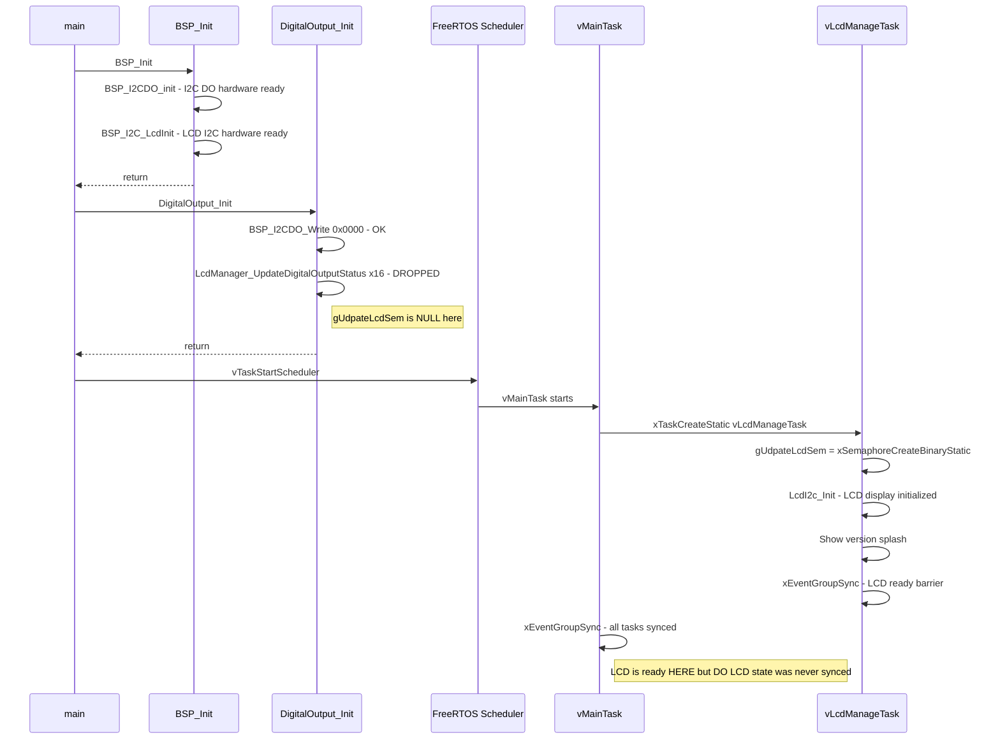
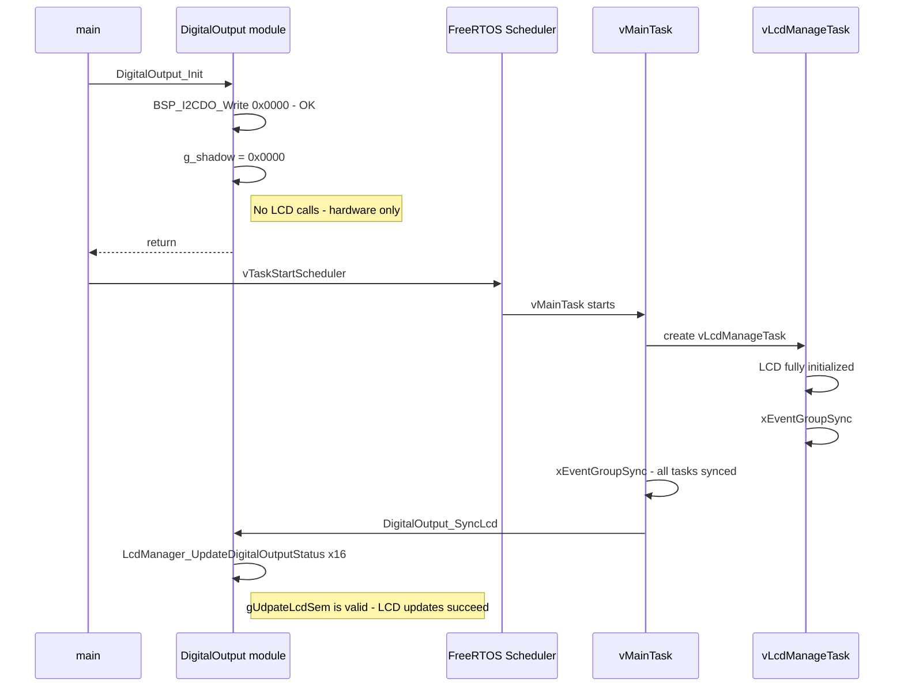

# Digital Output Init — Two-Phase Initialization Fix

## Problem

`DigitalOutput_Init()` is called at `main.c:400`, **before the FreeRTOS scheduler starts**. It does two things:

1. Writes `0x0000` to I2C expanders (all outputs off) — **works fine**
2. Calls `LcdManager_UpdateDigitalOutputStatus()` × 16 to sync LCD — **silently dropped**

The LCD updates are dropped because `gUdpateLcdSem` (the semaphore that gates all LCD writes) is `NULL` at that point. It is only created inside `vLcdManageTask()`, which is a FreeRTOS task spawned later in `vMainTask()`.

### Current Initialization Timeline



## Solution — Two-Phase Init

Split `DigitalOutput_Init()` into two functions:

| Function | When Called | What It Does |
|----------|------------|--------------|
| `DigitalOutput_Init` | Pre-scheduler in `main()` | I2C write 0x0000 + shadow register init. No LCD calls. |
| `DigitalOutput_SyncLcd` | Post-sync-barrier in `vMainTask()` | Reads shadow register, updates LCD for all 16 channels. |

### Fixed Initialization Timeline



## Changes Required

### 1. `application/inc/digital_output.h` — Add new function declaration

Add after `DigitalOutput_Init`:

```c
/**
 * @brief Synchronize the LCD display with the current shadow register state.
 *
 * Iterates over all 16 digital output channels and calls
 * LcdManager_UpdateDigitalOutputStatus() for each one, using the
 * current shadow register value.
 *
 * Must be called after the LCD manager task is initialized and the
 * sync event group barrier has been passed.
 */
void DigitalOutput_SyncLcd(void);
```

### 2. `application/src/digital_output.c` — Split Init, add SyncLcd

**Modify `DigitalOutput_Init()`** — remove the LCD update loop:

```c
bsp_error_t DigitalOutput_Init(void)
{
    bsp_error_t err = BSP_OK;

    /* Write 0x0000 to hardware to ensure all outputs are off */
    err = BSP_I2CDO_Write(0x0000U);

    if (BSP_OK == err)
    {
        g_shadow = 0x0000U;
        printf("[DO] Module initialized; all outputs OFF\r\n");
    }
    else
    {
        printf("[DO] Module initialization failed: I2C write error %d\r\n",
               (int)err);
    }

    return err;
}
```

**Add `DigitalOutput_SyncLcd()`**:

```c
void DigitalOutput_SyncLcd(void)
{
    for (uint16_t i = 0U; i < DIGITAL_OUTPUT_NUM_CHANNELS; i++)
    {
        bool val = ((g_shadow >> i) & 0x01U) != 0U;
        LcdManager_UpdateDigitalOutputStatus(i, val);
    }
    printf("[DO] LCD synced to shadow register 0x%04X\r\n", g_shadow);
}
```

### 3. `application/src/main.c` — Add SyncLcd call after sync barrier

`DigitalOutput_Init()` stays at line 400 (pre-scheduler). Add `DigitalOutput_SyncLcd()` in `vMainTask()` after the `xEventGroupSync` barrier:

```c
xEventGroupSync(xSyncEventGroup, APPTASK_MAIN_TASK_EVENT_MASK,
                APPTASK_ALL_TASK_EVENT_MASK, portMAX_DELAY);

/* Sync digital output LCD state now that LCD task is ready */
DigitalOutput_SyncLcd();
```

### 4. `plans/digital_output_module.md` — Add design decision

Add a new row to the Design Decisions table:

| # | Decision | Resolution |
|---|----------|------------|
| 12 | Init vs LCD ordering | Two-phase init: `Init` does hardware-only pre-scheduler; `SyncLcd` updates LCD post-sync-barrier |

Update the Init behavior row in the Function Behavior Summary table and add a SyncLcd row.

## Files Modified

| File | Change |
|------|--------|
| `application/inc/digital_output.h` | Add `DigitalOutput_SyncLcd()` declaration |
| `application/src/digital_output.c` | Remove LCD calls from `Init`, add `SyncLcd` function |
| `application/src/main.c` | Add `DigitalOutput_SyncLcd()` call after sync barrier in `vMainTask` |
| `plans/digital_output_module.md` | Add design decision #12, update function behavior table |

## No Files Created

This is a refactor of existing code only.

## Risk Assessment

- **Low risk**: `DigitalOutput_Init()` already works for I2C — we are only removing the no-op LCD calls
- **Low risk**: `DigitalOutput_SyncLcd()` is a new function but uses the same `LcdManager_UpdateDigitalOutputStatus()` API already proven in `SetChannel` and `WriteAll`
- **Timing**: Between `Init` and `SyncLcd`, the LCD will show whatever its default state is (spaces). This is fine — the version splash screen is displayed during this window anyway
