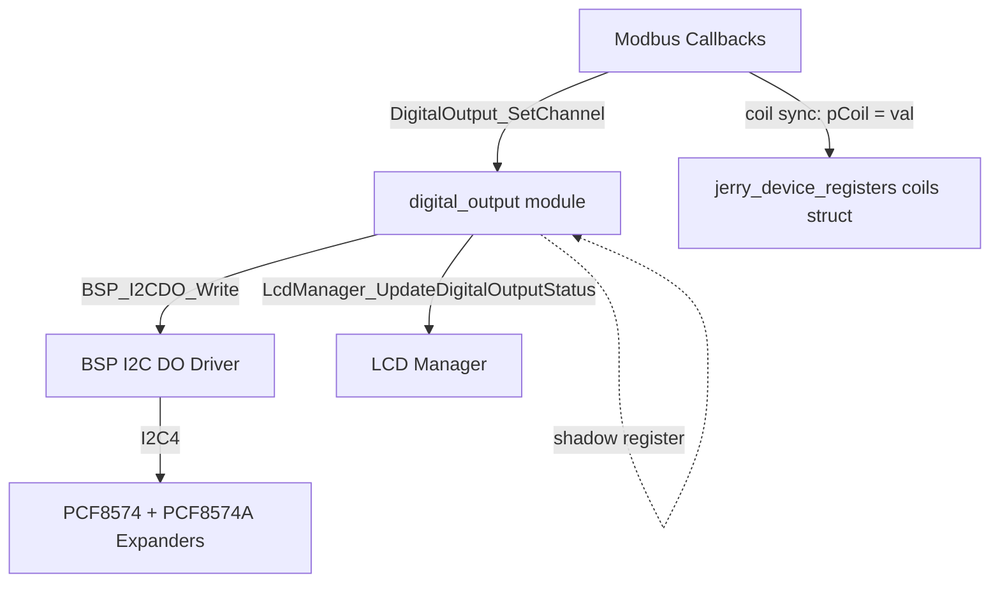

# Digital Output Module — Extraction Plan

## Summary

Extract the `update_digital_output()` function from `application/src/modbus_device_callbacks.c` into a standalone `digital_output` module that owns all digital output hardware control and LCD status updates.

## Design Decisions (from grill session)

| # | Decision | Resolution |
|---|----------|------------|
| 1 | Responsibility boundary | I2C hardware control + LCD update. Modbus coil sync stays in `modbus_device_callbacks.c` |
| 2 | File location | `application/src/digital_output.c` + `application/inc/digital_output.h` |
| 3 | Public API | `Init`, `SetChannel`, `GetChannel`, `ReadHardware`, `WriteAll` |
| 4 | WriteAll LCD behavior | Track changes via shadow diff, update LCD for each changed channel |
| 5 | State management | Shadow register — no read-before-write I2C transactions |
| 6 | Init behavior | Write 0x0000 to hardware, sync LCD to all-off, return `bsp_error_t` |
| 7 | Logging | `printf` debug logging moves into the new module |
| 8 | Init self-containment | Init writes 0x0000 to hardware itself, does not rely on BSP init ordering |
| 9 | Read split | `GetChannel` reads shadow; `ReadHardware` reads I2C for diagnostics |
| 10 | Channel constant | `DIGITAL_OUTPUT_NUM_CHANNELS (16U)` defined in header |
| 11 | CMake | Auto-picked up by `GLOB_RECURSE` — no CMake changes needed |

## Architecture



## Public API — `digital_output.h`

```c
#ifndef DIGITAL_OUTPUT_H
#define DIGITAL_OUTPUT_H

#include <stdbool.h>
#include <stdint.h>
#include "bsp.h"

#define DIGITAL_OUTPUT_NUM_CHANNELS (16U)

/**
 * @brief Initialize the digital output module.
 *
 * Writes 0x0000 to the I2C expanders (all outputs off), sets the
 * internal shadow register to 0, and updates the LCD for all 16
 * channels to "off".
 *
 * Must be called after BSP_I2C_Init() / BSP_I2CDO_init().
 *
 * @return bsp_error_t BSP_OK on success, error code on I2C failure.
 */
bsp_error_t DigitalOutput_Init(void);

/**
 * @brief Set a single digital output channel.
 *
 * Modifies the shadow register, writes the full 16-bit value to
 * hardware via I2C, and updates the LCD on success.
 *
 * @param channel Channel index (0-15, use BSP_I2CDO_INDEX_Dx macros).
 * @param value   true = ON, false = OFF.
 * @return bsp_error_t BSP_OK on success, BSP_INVALID_ARG if channel
 *         is out of range, or I2C error code on failure.
 */
bsp_error_t DigitalOutput_SetChannel(uint16_t channel, bool value);

/**
 * @brief Get the cached state of a single digital output channel.
 *
 * Reads from the internal shadow register (no I2C transaction).
 *
 * @param channel Channel index (0-15).
 * @param value   Pointer to store the current state.
 * @return bsp_error_t BSP_OK on success, BSP_INVALID_ARG if channel
 *         is out of range or value is NULL.
 */
bsp_error_t DigitalOutput_GetChannel(uint16_t channel, bool *value);

/**
 * @brief Read the actual hardware state of a single channel via I2C.
 *
 * Performs a BSP_I2CDO_Read() and extracts the specified channel bit.
 * Does NOT update the shadow register — this is a diagnostic/
 * verification function only.
 *
 * @param channel Channel index (0-15).
 * @param value   Pointer to store the hardware state.
 * @return bsp_error_t BSP_OK on success, BSP_INVALID_ARG if channel
 *         is out of range or value is NULL, or I2C error code.
 */
bsp_error_t DigitalOutput_ReadHardware(uint16_t channel, bool *value);

/**
 * @brief Write all 16 digital outputs at once.
 *
 * Writes the full 16-bit mask to hardware. Diffs against the shadow
 * register and calls LcdManager_UpdateDigitalOutputStatus() for each
 * channel that changed. Updates the shadow on success.
 *
 * @param mask 16-bit output mask (bit 0 = channel 0, etc.).
 * @return bsp_error_t BSP_OK on success, or I2C error code on failure.
 */
bsp_error_t DigitalOutput_WriteAll(uint16_t mask);

#endif /* DIGITAL_OUTPUT_H */
```

## Internal State — `digital_output.c`

```c
static uint16_t g_shadow = 0x0000U;  /* Tracks the last successfully written value */
```

## Function Behavior Summary

| Function | I2C Read | I2C Write | Shadow Update | LCD Update | Returns |
|----------|----------|-----------|---------------|------------|---------|
| `Init` | No | Yes (0x0000) | Yes (= 0) | Yes (all 16 channels off) | `bsp_error_t` |
| `SetChannel` | No | Yes | Yes (on success) | Yes (on success) | `bsp_error_t` |
| `GetChannel` | No | No | No | No | `bsp_error_t` |
| `ReadHardware` | Yes | No | No | No | `bsp_error_t` |
| `WriteAll` | No | Yes | Yes (on success) | Yes (changed channels, on success) | `bsp_error_t` |

## Changes to `modbus_device_callbacks.c`

1. **Remove** the `static void update_digital_output()` function (lines 167-211)
2. **Add** `#include "digital_output.h"`
3. **Replace** each `update_digital_output(BSP_I2CDO_INDEX_Dx, value, &coils->digital_output_x)` call in `modbus_cb_write_single_coil()` with:
   ```c
   if (BSP_OK == DigitalOutput_SetChannel(BSP_I2CDO_INDEX_Dx, value))
   {
       coils->digital_output_x = value;
   }
   ```
4. **Remove** the `#include "lcd_manager.h"` if no other code in the file uses it (it won't — only `update_digital_output` called `LcdManager_UpdateDigitalOutputStatus`)

## Changes to `main.c` (startup)

Add `DigitalOutput_Init()` call after `BSP_I2CDO_init()` in the initialization sequence.

## Files Created

| File | Purpose |
|------|---------|
| `application/inc/digital_output.h` | Public API header |
| `application/src/digital_output.c` | Implementation with shadow register, I2C writes, LCD updates, printf logging |

## Files Modified

| File | Change |
|------|--------|
| `application/src/modbus_device_callbacks.c` | Remove `update_digital_output()`, replace calls with `DigitalOutput_SetChannel()`, add coil sync at call site |
| `application/src/main.c` | Add `DigitalOutput_Init()` call in startup sequence |

## Coding Style Compliance (refs/cpp_coding_style.md)

The implementation must follow these conventions, consistent with the existing codebase:

| Rule | Convention | Example |
|------|-----------|---------|
| Function names | `PascalCase` with module prefix | `DigitalOutput_SetChannel()` |
| Local variables | `camelCase` | `initVal`, `finalVal` |
| Static globals | `g` prefix + `camelCase` or `snake_case` | `g_shadow` |
| Macros/Constants | `UPPER_SNAKE_CASE` | `DIGITAL_OUTPUT_NUM_CHANNELS` |
| Header guards | `#ifndef FILENAME_H` | `#ifndef DIGITAL_OUTPUT_H` |
| Include order | 1. Related header, 2. C system headers, 3. Project headers | `digital_output.h` first in `.c` |
| File names | All lowercase with underscores | `digital_output.c` |
| Error handling | Return `bsp_error_t` codes, no exceptions | `return BSP_INVALID_ARG;` |
| Doxygen comments | `@brief`, `@param`, `@return` style | Match existing BSP/LCD headers |
| Braces | Allman style (opening brace on new line) | Match existing `.c` files |

## No Changes Needed

- `application/CMakeLists.txt` — uses `GLOB_RECURSE`, auto-picks up new `.c` file
- `application/bsp/stm/bsp_i2c/bsp_i2c_do/bsp_i2c_do.c` — BSP layer unchanged
- `application/inc/lcd_manager.h` — API unchanged, just called from a different module now
