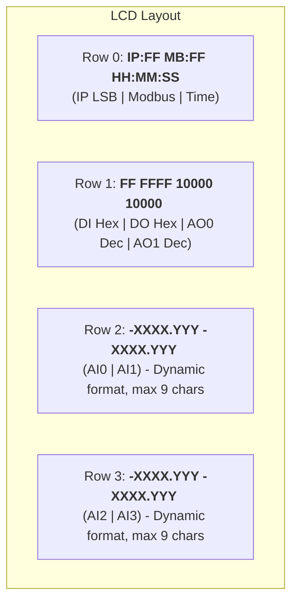

## LCD Layout Redesign Plan

### Objective
To redesign the LCD layout (20x4 characters) to display the last byte of the IPv4 address (hex), Modbus device address (hex), current RTC time, digital outputs (hex), digital inputs (hex), **all 4 analog input channels**, and **analog output channels 0 & 1** on a single static screen. 

### Final Static Layout: Max Compression

**Row Breakdown:**

*   **Row 0: IP (LSB Hex) | Modbus (Hex) | Time (HH:MM:SS)**
    *   Format: `IP:FF MB:FF HH:MM:SS`
    *   IP LSB: `IP:FF` (5 chars)
    *   Modbus: `MB:FF` (5 chars)
    *   Time: `HH:MM:SS` (8 chars)
    *   Total: 5 + 1 (space) + 5 + 1 (space) + 8 = 20 chars.

*   **Row 1: DI (Hex) | DO (Hex) | AO0 (Dec) | AO1 (Dec)**
    *   Format: `FF FFFF 10000 10000 `
    *   DI Hex: `FF` (2 chars)
    *   DO Hex: `FFFF` (4 chars)
    *   AO0 Dec: `10000` (5 chars, representing 0-10000 duty cycle)
    *   AO1 Dec: `10000` (5 chars, representing 0-10000 duty cycle)
    *   Total: 2 + 1 (space) + 4 + 1 (space) + 5 + 1 (space) + 5 + 1 (padding) = 20 chars.

*   **Rows 2 & 3: Analog Inputs (AI0-3)**
    *   Format: `-XXXX.YYY -XXXX.YYY `
    *   AI Dynamic Formatting (max 9 chars per value, NO prefix):
        *   Raw ADC (0-4096): `4096     `
        *   Calibrated `+/-X.YYY`: `-X.YYY   `
        *   Calibrated `+/-XX.YYY`: `-XX.YYY  `
        *   Calibrated `+/-XXX.YYY`: `-XXX.YYY `
        *   Calibrated `+/-XXXX.YYY`: `-XXXX.YY ` (truncate last decimal)
    *   Total: 9 (AI0/2) + 1 (space) + 9 (AI1/3) + 1 (padding) = 20 chars.

### Implementation Todo List

- [ ] Modify `application/inc/lcd_manager.h` to update function comments and prototypes for the new layout. Add `LcdManager_UpdateTime` and update AO/DI/DO functions.
- [ ] Modify `application/src/lcd_manager.c` to implement the layout:
    - Update Row 0 formatting to include Time instead of DI.
    - Update Row 1 formatting to `"%02X %04X %05u %05u "` for DI, DO, AO0, AO1.
- [ ] Modify `application/src/monitor_task.c` to call the updated LCD update functions with appropriate values (fetching RTC time via `RTC_Manager_GetTimeAndDate`).
