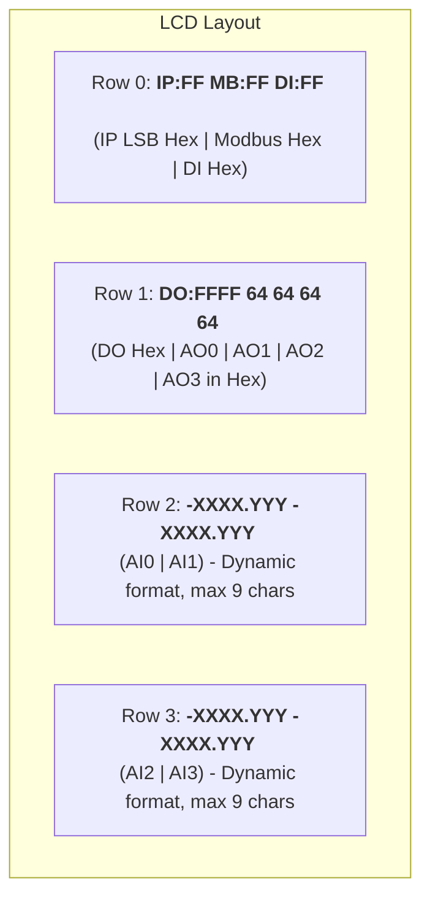

## LCD Layout Redesign Plan

### Objective
To redesign the LCD layout (20x4 characters) to display the last byte of the IPv4 address (hex), Modbus device address (hex), digital outputs (hex), digital inputs (hex), **all 4 analog input channels**, and **all 4 analog output channels** on a single static screen. 

### Final Static Layout: Max Compression with Hex

**Row Breakdown:**

*   **Row 0: IP (LSB Hex) | Modbus (Hex) | DI (Hex)**
    *   Format: `IP:FF MB:FF DI:FF   `
    *   IP LSB: `IP:FF` (5 chars)
    *   Modbus: `MB:FF` (5 chars)
    *   DI Hex: `DI:FF` (5 chars)
    *   Total: 5 + 1 (space) + 5 + 1 (space) + 5 + 3 (padding) = 20 chars.

*   **Row 1: DO (Hex) | AO0-3 (Hex)**
    *   Format: `DO:FFFF 64 64 64 64 `
    *   DO Hex: `DO:FFFF` (7 chars)
    *   AO0-3 Hex: `64` (2 chars each, representing 0-100% duty cycle as 0x00-0x64)
    *   Total: 7 + 1 (space) + 2 + 1 + 2 + 1 + 2 + 1 + 2 + 1 (padding) = 20 chars.

*   **Rows 2 & 3: Analog Inputs (AI0-3)**
    *   Format: `-XXXX.YYY -XXXX.YYY `
    *   AI Dynamic Formatting (max 9 chars per value, NO prefix):
        *   Raw ADC (0-4096): `4096     `
        *   Calibrated `+/-X.YYY`: `-X.YYY   `
        *   Calibrated `+/-XX.YYY`: `-XX.YYY  `
        *   Calibrated `+/-XXX.YYY`: `-XXX.YYY `
        *   Calibrated `+/-XXXX.YYY`: `-XXXX.YY ` (truncate last decimal)
    *   Total: 9 (AI0/2) + 1 (space) + 9 (AI1/3) + 1 (padding) = 20 chars.

### Implementation Todo List

- [ ] Modify `application/inc/lcd_manager.h` to update function comments for the new hyper-compressed layout. Update `LcdManager_UpdateIpv4Address` to accept a byte or update its documentation to clarify it parses the string for the last byte.
- [ ] Modify `application/src/lcd_manager.c` to implement the layout:
    - Update `LcdManager_UpdateIpv4Address` to parse the string and only display `IP:XX` (Hex).
    - Update Modbus display to `MB:XX` (Hex).
    - Update DO display to `DO:FFFF`.
    - Update DI display to `DI:FF`.
    - Implement `LcdManager_UpdateAnalogInput` (no prefix, dynamic format up to 9 chars).
    - Implement `LcdManager_UpdateAnalogOutput` to display duty cycle as 2-digit Hex (00-64).
- [ ] Modify `application/src/monitor_task.c` to call the updated LCD update functions with appropriate values.
