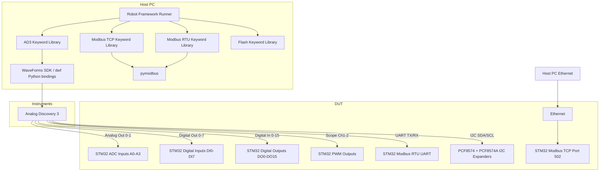
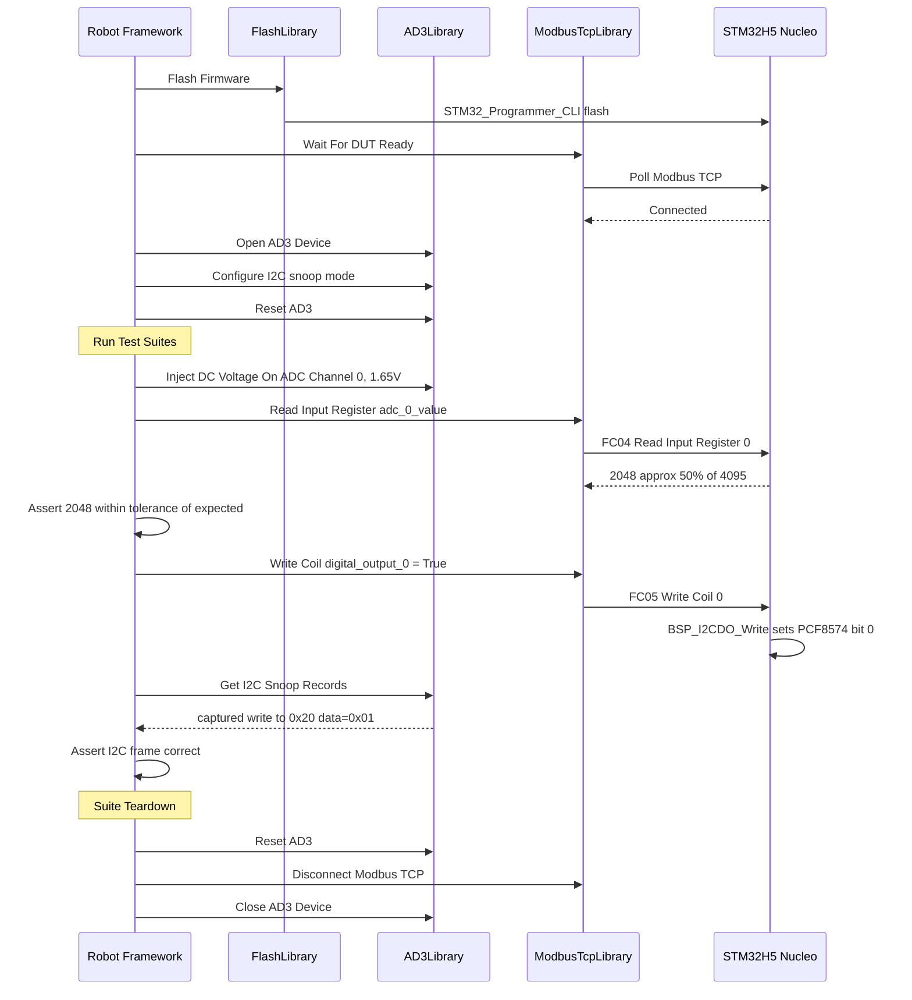

# Robot Framework Hardware-in-the-Loop Test Architecture

> **Revision 0.2** — Added I2C test suite (PCF8574/PCF8574A expanders) and negative test cases across all domains.

| Property | Value |
| :--- | :--- |
| Version | 0.1 |
| Status | Draft |
| Hardware | STM32H563ZI Nucleo + Analog Discovery 3 |

---

## 1. Overview

This document describes the architecture for a **Hardware-in-the-Loop (HIL) test framework** using:

- **Robot Framework** as the test orchestration layer
- **Analog Discovery 3 (AD3)** as the hardware stimulus/measurement instrument
- **STM32H563ZI Nucleo** as the Device Under Test (DUT)
- **Modbus TCP** and **Modbus RTU** as the primary DUT communication protocols

The AD3 replaces manual bench instruments by providing:
- Programmable analog voltage sources (Wavegen) → stimulate ADC inputs
- Oscilloscope channels → measure PWM outputs
- Digital I/O channels → drive digital inputs / read digital outputs
- I2C protocol analyzer → verify PCF8574/PCF8574A expander transactions
- UART protocol analyzer → Modbus RTU loopback testing *(future: requires RTU task in firmware)*

> **⚠️ Modbus RTU Status:** The Modbus RTU library ([`modbus_rtu.c`](application/dependencies/modbus/src/protocol/modbus_rtu.c)) is compiled and `MODBUS_ENABLE_RTU=1` in [`modbus_config.h`](application/dependencies/modbus/inc/modbus_config.h:17), but the current application only has a single [`vModbusTask`](application/inc/app_tasks.h:39) which is a **TCP-only** server over lwIP. There is no RTU task wired to a UART peripheral. The Modbus RTU test suite (`05_modbus_rtu/`) is therefore **future work** and should only be implemented once an RTU task is added to the firmware.

---

## 2. System Architecture Diagram



---

## 3. Directory Structure

```
jerry/
├── tests/
│   ├── robot/                          # NEW: Robot Framework tests
│   │   ├── resources/                  # Shared RF resource files
│   │   │   ├── common.resource         # Common keywords and variables
│   │   │   ├── ad3.resource            # AD3 hardware keywords
│   │   │   ├── modbus_tcp.resource     # Modbus TCP keywords
│   │   │   └── modbus_rtu.resource     # Modbus RTU keywords
│   │   ├── libraries/                  # Python keyword libraries
│   │   │   ├── __init__.py
│   │   │   ├── AD3Library.py           # Analog Discovery 3 wrapper (Wavegen, Scope, DIO, UART, I2C)
│   │   │   ├── ModbusTcpLibrary.py     # Modbus TCP keyword library
│   │   │   ├── ModbusRtuLibrary.py     # Modbus RTU keyword library
│   │   │   └── FlashLibrary.py         # Firmware flash keyword library
│   │   ├── suites/                     # Test suites
│   │   │   ├── 01_digital_io/
│   │   │   │   ├── test_digital_outputs.robot       # Positive: DO0-DO15 via Modbus coils
│   │   │   │   ├── test_digital_inputs.robot        # Positive: DI0-DI7 via AD3 DIO
│   │   │   │   └── test_digital_io_negative.robot   # Negative: invalid addresses, read-only violations
│   │   │   ├── 02_adc/
│   │   │   │   ├── test_adc_accuracy.robot          # Positive: voltage sweep accuracy
│   │   │   │   ├── test_adc_filter.robot            # Positive: 50Hz notch filter
│   │   │   │   └── test_adc_negative.robot          # Negative: out-of-range, write to read-only
│   │   │   ├── 03_pwm/
│   │   │   │   ├── test_pwm_frequency.robot         # Positive: frequency accuracy
│   │   │   │   ├── test_pwm_duty_cycle.robot        # Positive: duty cycle accuracy
│   │   │   │   └── test_pwm_negative.robot          # Negative: invalid freq/duty values
│   │   │   ├── 04_i2c/
│   │   │   │   ├── test_i2c_do_expander.robot       # Positive: PCF8574/PCF8574A via AD3 I2C snoop
│   │   │   │   └── test_i2c_negative.robot          # Negative: wrong address, bus fault injection
│   │   │   ├── 05_modbus_rtu/                       # FUTURE: requires RTU UART task in firmware
│   │   │   │   ├── test_modbus_rtu_coils.robot      # Positive: RTU coil R/W
│   │   │   │   ├── test_modbus_rtu_registers.robot  # Positive: RTU register R/W
│   │   │   │   └── test_modbus_rtu_negative.robot   # Negative: bad CRC, wrong FC, timeout
│   │   │   ├── 06_modbus_tcp/
│   │   │   │   ├── test_modbus_tcp_coils.robot      # Positive: TCP coil R/W
│   │   │   │   ├── test_modbus_tcp_registers.robot  # Positive: TCP register R/W
│   │   │   │   └── test_modbus_tcp_negative.robot   # Negative: invalid FC, out-of-range addr
│   │   │   └── 07_system/
│   │   │       └── test_system_integration.robot    # End-to-end cross-domain tests
│   │   ├── config/
│   │   │   ├── hardware_config.yaml    # Hardware connection map
│   │   │   └── test_variables.yaml     # Test parameters
│   │   └── README.md
│   ├── integration/                    # Existing pytest integration tests
│   ├── unit/                           # Existing Unity C unit tests
│   └── unit_python/                    # Existing pytest unit tests
```

---

## 4. Hardware Connection Map

### 4.1 Analog Discovery 3 Capabilities Used

| AD3 Channel | AD3 Function | STM32H5 Nucleo Pin | STM32 Function |
|---|---|---|---|
| W1 (Wavegen 1) | Analog Out 0-3.3V | CN7 pin A0 (PA0) | ADC1 Channel A0 |
| W2 (Wavegen 2) | Analog Out 0-3.3V | CN7 pin A1 (PA1) | ADC1 Channel A1 |
| Scope CH1+ | Oscilloscope | CN10 PWM_0 pin | TIM PWM Out 0 |
| Scope CH2+ | Oscilloscope | CN10 PWM_1 pin | TIM PWM Out 1 |
| DIO 0-7 | Digital Output | CN8 DI0-DI7 | GPIO Digital Inputs |
| DIO 8-15 | Digital Input | I2C Expander DO0-DO7 | PCF8574 outputs |
| UART TX | UART | CN3 USART RX | Modbus RTU UART |
| UART RX | UART | CN3 USART TX | Modbus RTU UART |
| I2C SDA | I2C Protocol Analyzer | I2C4 SDA (PB7) | I2C4 bus (PCF8574/PCF8574A) |
| I2C SCL | I2C Protocol Analyzer | I2C4 SCL (PB6) | I2C4 bus (PCF8574/PCF8574A) |
| GND | Common Ground | GND | GND |

> **Note 1:** AD3 Wavegen outputs 0-5V max; use a voltage divider or ensure 3.3V VREF on STM32 ADC. AD3 digital I/O is 3.3V compatible.
>
> **Note 2:** The AD3 I2C interface connects **in parallel** (bus snoop/master mode) to the STM32 I2C4 bus. In snoop mode it passively captures all transactions. In master mode it can independently address PCF8574 (0x20) and PCF8574A (0x21) to verify expander state without going through Modbus. Use 4.7kΩ pull-ups on SDA/SCL if not already present on the Nucleo board.
>
> **Note 3:** AD3 DIO 8-15 read the PCF8574 output pins directly (open-drain outputs of PCF8574 pulled high = logic 1). This provides a second independent readback path for DO0-DO7 alongside the I2C snoop.

### 4.2 `config/hardware_config.yaml`

```yaml
dut:
  modbus_tcp_host: "192.168.1.100"
  modbus_tcp_port: 502
  modbus_unit_id: 1
  modbus_rtu_port: "/dev/ttyUSB0"
  modbus_rtu_baudrate: 115200

ad3:
  serial_number: ""          # Leave empty to use first found device
  wavegen_vref: 3.3          # Volts - matches STM32 ADC VREF

  # Analog output to ADC input mapping
  adc_channels:
    - ad3_wavegen: 1         # AD3 W1
      stm32_channel: 0       # BSP_ADC1_CHANNEL_A0
      modbus_input_reg: 100  # adc_0_value register address
    - ad3_wavegen: 2
      stm32_channel: 1
      modbus_input_reg: 101

  # Digital I/O mapping
  digital_inputs:            # AD3 drives these (DIO 0-7 as outputs)
    count: 8
    ad3_dio_start: 0         # AD3 DIO 0-7
    modbus_discrete_input_start: 0

  digital_outputs:           # AD3 reads these (DIO 8-15 as inputs)
    count: 8                 # First 8 of 16 DO channels
    ad3_dio_start: 8         # AD3 DIO 8-15
    modbus_coil_start: 0

  # PWM measurement
  pwm_channels:
    - ad3_scope_channel: 1   # Scope CH1
      modbus_pwm_freq_reg: 50
      modbus_pwm_duty_reg: 51
    - ad3_scope_channel: 2
      modbus_pwm_freq_reg: 52
      modbus_pwm_duty_reg: 53

  # UART for Modbus RTU
  uart:
    baudrate: 115200
    parity: "N"
    stop_bits: 1

  # I2C for PCF8574/PCF8574A expander verification
  i2c:
    clock_hz: 100000          # 100kHz standard mode (matches STM32 I2C4 config)
    pcf8574_addr: 0x20        # 7-bit address of PCF8574 (DO0-DO7)
    pcf8574a_addr: 0x21       # 7-bit address of PCF8574A (DO8-DO15)
    snoop_mode: true          # true = passive snoop; false = AD3 as I2C master
```

---

## 5. Python Keyword Libraries

### 5.1 `AD3Library.py`

Wraps the **WaveForms SDK** (`dwf` Python bindings, installed via `pip install dwf` or the Digilent WaveForms SDK).

```
Class: AD3Library
  Robot Name: AD3 Library

  Keywords:
    Open AD3 Device          - Connect to AD3 by serial number or first found
    Close AD3 Device         - Release AD3 device handle
    Set Analog Output        - Set Wavegen channel to DC voltage (channel, voltage_v)
    Set Analog Waveform      - Set Wavegen to sine/square/triangle (channel, freq, amplitude, offset)
    Get Scope Measurement    - Measure frequency and duty cycle on scope channel
    Set Digital Output       - Set DIO pin high/low (pin, value)
    Set Digital Output Mask  - Set multiple DIO pins at once (mask, value)
    Get Digital Input        - Read DIO pin state (pin) -> bool
    Get Digital Input Mask   - Read multiple DIO pins (mask) -> int
    Set UART Config          - Configure UART (baudrate, parity, stop_bits)
    Send UART Bytes          - Send raw bytes over UART
    Receive UART Bytes       - Receive N bytes from UART with timeout
    # I2C keywords (AD3 Protocol Analyzer / I2C master)
    Configure I2C            - Set I2C clock frequency and mode (snoop/master)
    I2C Write                - Write bytes to I2C slave address (addr, data_bytes)
    I2C Read                 - Read N bytes from I2C slave address (addr, count) -> bytes
    I2C Write Read           - Combined write then read (addr, write_bytes, read_count)
    Start I2C Snoop          - Begin passive capture of I2C bus transactions
    Stop I2C Snoop           - Stop capture and return list of captured transactions
    Get I2C Snoop Records    - Return captured I2C transactions as list of dicts
    Reset AD3                - Reset all AD3 outputs to safe state
```

**Key design decisions:**
- Uses `ctypes`-based `dwf` library (Digilent's official Python wrapper)
- All voltage/frequency parameters validated against AD3 hardware limits
- `Reset AD3` called in suite teardown to prevent DUT damage on test failure
- Thread-safe: single AD3 instance shared across all keyword libraries via `robot.libraries.AD3Library`
- I2C snoop mode: AD3 passively captures all I2C4 bus traffic triggered by Modbus coil writes, allowing independent verification that the STM32 actually sent the correct I2C frames to PCF8574/PCF8574A
- I2C master mode: AD3 directly reads PCF8574/PCF8574A register state without involving the STM32, useful for fault injection tests

### 5.2 `ModbusTcpLibrary.py`

Thin wrapper over `pymodbus` with Robot Framework-friendly keywords.

```
Class: ModbusTcpLibrary
  Robot Name: Modbus TCP Library

  Keywords:
    Connect Modbus TCP       - Connect to host:port
    Disconnect Modbus TCP    - Close connection
    Read Coil                - FC01 read single coil (address) -> bool
    Write Coil               - FC05 write single coil (address, value)
    Write Multiple Coils     - FC15 write multiple coils (address, values_list)
    Read Discrete Input      - FC02 read single discrete input (address) -> bool
    Read Holding Register    - FC03 read single holding register (address) -> int
    Read Holding Float       - FC03 read float32 from 2 registers (address) -> float
    Write Holding Register   - FC06 write single holding register (address, value)
    Write Multiple Registers - FC16 write multiple registers (address, values_list)
    Read Input Register      - FC04 read single input register (address) -> int
    Read Input Float         - FC04 read float32 from 2 input registers (address) -> float
    Verify Coil State        - Read coil and assert expected value
    Verify Register Value    - Read register and assert expected value with tolerance
```

### 5.3 `ModbusRtuLibrary.py`

Uses `pymodbus` serial client for RTU testing via AD3 UART.

```
Class: ModbusRtuLibrary
  Robot Name: Modbus RTU Library

  Keywords:
    Connect Modbus RTU       - Connect via serial port (port, baudrate, parity)
    Disconnect Modbus RTU    - Close serial connection
    Read Coil RTU            - FC01 via RTU
    Write Coil RTU           - FC05 via RTU
    Read Holding Register RTU
    Write Holding Register RTU
    Read Input Register RTU
    Send Raw RTU Frame       - Send raw bytes and capture response (for error testing)
    Verify RTU Response      - Assert RTU response matches expected frame
```

### 5.4 `FlashLibrary.py`

Wraps `tools/flash_nucleo.py` for pre-suite firmware flashing.

```
Class: FlashLibrary
  Robot Name: Flash Library

  Keywords:
    Flash Firmware           - Flash secure + non-secure ELF to DUT
    Flash Firmware If Needed - Flash only if build hash changed
    Wait For DUT Ready       - Poll Modbus TCP until DUT responds (timeout)
    Get Firmware Version     - Read version registers via Modbus TCP
```

---

## 6. Robot Framework Resource Files

### 6.1 `resources/common.resource`

```robotframework
*** Settings ***
Library    libraries/AD3Library.py
Library    libraries/ModbusTcpLibrary.py
Library    libraries/FlashLibrary.py
Variables  config/hardware_config.yaml

*** Variables ***
${DUT_HOST}         192.168.1.100
${DUT_PORT}         502
${DUT_UNIT_ID}      1
${ADC_TOLERANCE}    0.02    # 2% tolerance for ADC accuracy tests

*** Keywords ***
Suite Hardware Setup
    Open AD3 Device
    Connect Modbus TCP    ${DUT_HOST}    ${DUT_PORT}
    Wait For DUT Ready    timeout=10s

Suite Hardware Teardown
    Reset AD3
    Disconnect Modbus TCP
    Close AD3 Device
```

### 6.2 `resources/ad3.resource`

Higher-level keywords composing `AD3Library` primitives:

```robotframework
*** Keywords ***
Inject DC Voltage On ADC Channel
    [Arguments]    ${channel}    ${voltage_v}
    Set Analog Output    ${channel}    ${voltage_v}
    Sleep    50ms    # Allow ADC filter to settle

Drive Digital Input High
    [Arguments]    ${di_index}
    Set Digital Output    ${di_index}    1

Drive Digital Input Low
    [Arguments]    ${di_index}
    Set Digital Output    ${di_index}    0

Read Digital Output State
    [Arguments]    ${do_index}
    ${ad3_pin}=    Evaluate    ${do_index} + 8
    ${state}=    Get Digital Input    ${ad3_pin}
    RETURN    ${state}

Measure PWM On Channel
    [Arguments]    ${scope_channel}
    ${result}=    Get Scope Measurement    ${scope_channel}
    RETURN    ${result}
```

---

## 7. Test Suite Design

### 7.1 Digital I/O Tests (`suites/01_digital_io/`)

**`test_digital_outputs.robot`** — Positive
- For each DO (0-15): write coil via Modbus TCP → read AD3 DIO → assert match
- Test all-ON, all-OFF, alternating patterns (0xAAAA, 0x5555, 0xFFFF, 0x0000)
- Verify DO state persists after Modbus reconnect
- Verify DO state via both AD3 DIO readback AND AD3 I2C snoop (two independent paths)

**`test_digital_inputs.robot`** — Positive
- For each DI (0-7): drive AD3 DIO high/low → read discrete input via Modbus TCP → assert match
- Test all-HIGH, all-LOW, walking-bit patterns
- Verify DI mirror coil (address 16-23) matches discrete input register

**`test_digital_io_negative.robot`** — Negative
- Write to read-only coil (DI mirror at address 16-23) → expect Modbus exception code 0x01 (Illegal Function) or 0x02 (Illegal Data Address)
- Read coil at address beyond valid range (e.g., address 65535) → expect exception response
- Write multiple coils with count=0 → expect exception response
- Write coil with invalid value (not 0x0000 or 0xFF00 in FC05) → expect exception response

### 7.2 ADC Tests (`suites/02_adc/`)

**`test_adc_accuracy.robot`** — Positive
- For each ADC channel (0-3):
  - Inject 0V, 0.5V, 1.0V, 1.65V, 2.5V, 3.3V via AD3 Wavegen
  - Read `adc_N_value` input register (address 0-3) via Modbus TCP
  - Read `adc_N_calibrated_value` float32 input register (address 4-11) via Modbus TCP
  - Assert raw reading within ±2% of expected (12-bit, 0-4095 range)
- Verify ADC linearity across full range (10-point sweep)

**`test_adc_filter.robot`** — Positive
- Inject 50Hz sine wave (mains frequency) via AD3 Wavegen
- Read filtered ADC value → assert notch filter attenuates 50Hz by >40dB
- Inject DC + 50Hz → verify DC component preserved, 50Hz rejected
- Verify filter settling: wait 200ms after power-on, assert calibrated value stable

**`test_adc_negative.robot`** — Negative
- Write to read-only ADC input register (address 0-3) → expect exception 0x01
- Write `adc_N_scale_factor` with NaN (0x7FC00000) → verify firmware rejects or clamps
- Write `adc_N_scale_factor` with ±Inf → verify firmware rejects or clamps
- Read input register at address beyond valid range → expect exception 0x02
- Write `adc_N_dead_zone` with negative float → verify firmware handles gracefully

### 7.3 PWM Tests (`suites/03_pwm/`)

**`test_pwm_frequency.robot`** — Positive
- Enable PWM channel via Modbus coil (address 24-27)
- Set PWM frequency via holding register
- Measure actual frequency with AD3 scope
- Assert measured frequency within ±1% of set value
- Test range: 100Hz, 1kHz, 10kHz, 50kHz

**`test_pwm_duty_cycle.robot`** — Positive
- Set duty cycle via holding register (0%, 25%, 50%, 75%, 100%)
- Measure actual duty cycle with AD3 scope
- Assert measured duty cycle within ±1% of set value

**`test_pwm_negative.robot`** — Negative
- Set PWM frequency to 0Hz → verify firmware rejects or clamps to minimum
- Set PWM frequency above hardware maximum → verify firmware clamps
- Set duty cycle > 100% → verify firmware clamps to 100%
- Set duty cycle to negative value (as uint16 wrap-around) → verify firmware handles
- Enable PWM channel while frequency register is 0 → verify safe behavior (no output or minimum freq)
- Write to PWM holding register with count exceeding register map → expect exception 0x02

### 7.4 I2C Tests (`suites/04_i2c/`)

**Background:** The STM32 uses I2C4 to drive two PCF8574-family expanders:
- **PCF8574** at address `0x20` → controls DO0-DO7 (lower byte of [`BSP_I2CDO_Write()`](application/bsp/stm/bsp.c:630))
- **PCF8574A** at address `0x21` → controls DO8-DO15 (upper byte of [`BSP_I2CDO_Write()`](application/bsp/stm/bsp.c:630))

The AD3 connects to the I2C4 bus in two modes:
1. **Snoop mode** (passive): captures all I2C transactions triggered by Modbus coil writes
2. **Master mode** (active): AD3 directly reads PCF8574/PCF8574A to verify state independently

**`test_i2c_do_expander.robot`** — Positive
- Write DO0-DO7 coils via Modbus TCP → start AD3 I2C snoop → trigger write → stop snoop
  - Assert snoop captured a write to address 0x20 with correct data byte
- Write DO8-DO15 coils via Modbus TCP → assert snoop captured write to address 0x21
- Write all-ON (0xFFFF) → AD3 I2C master reads PCF8574 (0x20) → assert byte = 0xFF
- Write all-ON (0xFFFF) → AD3 I2C master reads PCF8574A (0x21) → assert byte = 0xFF
- Write alternating pattern (0xAA55) → verify PCF8574 = 0x55, PCF8574A = 0xAA via AD3 I2C read
- Walking-bit test: set each DO individually → verify correct I2C byte sent to correct expander
- Verify I2C transaction timing: assert SCL frequency matches configured 100kHz (±10%)
- Verify I2C address phase: assert 7-bit address + W bit correct in snoop records

**`test_i2c_negative.robot`** — Negative
- AD3 I2C master attempts read from non-existent address (e.g., 0x77) → assert NACK received
- AD3 I2C master sends malformed START-STOP sequence → assert bus recovers (STM32 still responds to Modbus)
- Write Modbus coil while AD3 holds I2C bus SCL low (clock stretching simulation) → assert STM32 returns BSP_TIMEOUT and Modbus reports error status register
- Disconnect PCF8574 SDA (simulate open-circuit) → write DO coil → assert Modbus error register reflects I2C failure
- Write to I2C expander address via AD3 master (conflicting master) → assert bus arbitration handled (no firmware crash, Modbus still responsive)

### 7.5 Modbus RTU Tests (`suites/05_modbus_rtu/`) — ⚠️ FUTURE WORK

> **Prerequisite:** A `vModbusRtuTask` must be added to the firmware that runs the RTU slave over a UART peripheral (e.g., USART1 or USART2). The [`modbus_rtu.c`](application/dependencies/modbus/src/protocol/modbus_rtu.c) library is already compiled with `MODBUS_ENABLE_RTU=1` in [`modbus_config.h`](application/dependencies/modbus/inc/modbus_config.h:17); only the application-level task and UART wiring are missing. The current [`vModbusTask`](application/inc/app_tasks.h:39) is TCP-only.

**`test_modbus_rtu_coils.robot`** — Positive *(implement after RTU task exists)*
- Connect via AD3 UART (Modbus RTU)
- Read/write coils via RTU, verify same register map as TCP
- Test broadcast address (unit_id=0) for write operations

**`test_modbus_rtu_registers.robot`** — Positive *(implement after RTU task exists)*
- Read/write holding registers via RTU
- Verify float32 encoding (2-register, big-endian word order) for ADC scale/offset registers
- Verify cross-protocol consistency: write via RTU → read back via TCP → assert same value

**`test_modbus_rtu_negative.robot`** — Negative *(implement after RTU task exists)*
- Send RTU frame with **bad CRC** → assert no response (RTU silently discards)
- Send RTU frame with **wrong unit ID** → assert no response
- Send RTU frame with **unsupported function code** → assert exception response 0x01
- Send RTU frame with **data address out of range** → assert exception response 0x02
- Send RTU frame with **quantity out of range** (e.g., read 126 registers, max is 125) → assert exception response 0x03
- Send **partial frame** (truncated after address byte) → assert no response (timeout)
- Send frame with **inter-character gap > 1.5 character times** → assert frame treated as two separate (invalid) frames
- Send **back-to-back frames** with no inter-frame gap → assert second frame rejected

### 7.6 Modbus TCP Tests (`suites/06_modbus_tcp/`)

**`test_modbus_tcp_coils.robot`** — Positive
- Mirrors existing [`tests/integration/test_coils.py`](tests/integration/test_coils.py) in Robot Framework format
- All 16 digital outputs (coils 0-15), all 8 digital inputs (coils 16-23), PWM enables (24-27)

**`test_modbus_tcp_registers.robot`** — Positive
- Mirrors existing [`tests/integration/test_holding_registers.py`](tests/integration/test_holding_registers.py)
- Float32 registers (ADC scale/offset/dead_zone), RTC registers, version registers

**`test_modbus_tcp_negative.robot`** — Negative
- Read coil at address 65535 → expect exception 0x02 (Illegal Data Address)
- Write to read-only input register via FC06 → expect exception 0x01
- FC03 read with count=0 → expect exception 0x03 (Illegal Data Value)
- FC03 read with count=126 (exceeds max 125) → expect exception 0x03
- FC16 write with byte_count mismatch → expect exception 0x03
- Send TCP connection with malformed MBAP header (wrong protocol ID) → assert connection dropped or exception
- Open 2 simultaneous TCP connections → assert both receive correct independent responses
- Disconnect TCP mid-transaction → assert DUT recovers and accepts new connection

### 7.7 System Integration Tests (`suites/07_system/`)

**`test_system_integration.robot`**
- End-to-end: inject voltage via AD3 Wavegen → read `adc_N_value` input register → assert within tolerance
- End-to-end: write DO coil → verify AD3 DIO reads correct output AND AD3 I2C snoop confirms correct PCF8574 byte
- End-to-end: drive DI via AD3 DIO → verify discrete input register AND mirror coil both update
- Cross-protocol: write holding register via RTU → read back via TCP → assert same value
- System tick register (address 200-201) increments monotonically over 5 seconds
- RTC: write date/time via holding registers → read back → assert match
- ADC calibration round-trip: write scale_factor=2.0 → inject 1.0V → assert calibrated value ≈ 2.0V equivalent
- Power-cycle recovery: flash firmware → wait for DUT ready → assert all registers at default values

---

## 8. Negative Test Case Strategy

Negative tests are organized by **failure category** to ensure systematic coverage:

| Category | Description | Affected Suites |
|---|---|---|
| **Invalid Address** | Register/coil address outside defined map | All Modbus suites, Digital I/O |
| **Invalid Quantity** | Count=0, count>max, byte_count mismatch | Modbus TCP/RTU |
| **Read-Only Violation** | Write to input register or read-only coil | ADC, Digital I/O |
| **Invalid Data Value** | NaN/Inf for float, out-of-range uint | ADC, PWM |
| **Protocol Framing Error** | Bad CRC, wrong unit ID, partial frame, inter-frame gap | Modbus RTU |
| **Transport Error** | Malformed MBAP, mid-transaction disconnect | Modbus TCP |
| **I2C Bus Fault** | NACK, clock stretch, conflicting master, open-circuit | I2C |
| **Boundary Conditions** | Min/max register values, 0% and 100% duty cycle | PWM, ADC |

### Negative Test Tagging Convention

All negative tests carry the Robot Framework tag `negative`. Additional tags narrow the category:

```robotframework
*** Test Cases ***
Write To Read Only ADC Register Should Return Exception
    [Tags]    negative    modbus    read_only_violation
    ...

Send RTU Frame With Bad CRC Should Get No Response
    [Tags]    negative    modbus_rtu    framing_error
    ...

I2C Master Reads Non Existent Address Should Get NACK
    [Tags]    negative    i2c    bus_fault
    ...
```

Run only negative tests:
```bash
uv run robot --include negative --outputdir build/robot_results tests/robot/suites/
```

Run only I2C negative tests:
```bash
uv run robot --include negative AND i2c --outputdir build/robot_results tests/robot/suites/04_i2c/
```

---

## 9. Test Execution Flow



---

## 10. Dependency Management via CMake `FetchContent`

Following the same pattern as Unity (fetched in [`tests/unit/CMakeLists.txt`](tests/unit/CMakeLists.txt:22)), **all Robot Framework test dependencies are fetched from GitHub using CMake `FetchContent`** and installed into the `uv`-managed virtual environment at configure time.

### 10.1 New file: `tests/robot/CMakeLists.txt`

```cmake
# =============================================================================
# Robot Framework HIL Tests CMakeLists.txt
# =============================================================================
# Fetches Robot Framework and all Python test dependencies from GitHub using
# FetchContent, then installs them into the uv-managed virtual environment.
#
# Pattern mirrors tests/unit/CMakeLists.txt (Unity via FetchContent).
# =============================================================================

cmake_minimum_required(VERSION 3.22)
project(robot_hil_tests NONE)

include(FetchContent)

# -----------------------------------------------------------------------------
# 1. Robot Framework — fetched from GitHub
# -----------------------------------------------------------------------------
FetchContent_Declare(
    robotframework
    GIT_REPOSITORY https://github.com/robotframework/robotframework.git
    GIT_TAG        v7.2.2
    SOURCE_DIR     ${CMAKE_CURRENT_BINARY_DIR}/_deps/robotframework-src
)
FetchContent_MakeAvailable(robotframework)

# -----------------------------------------------------------------------------
# 2. pymodbus — fetched from GitHub (already used by integration tests)
# -----------------------------------------------------------------------------
FetchContent_Declare(
    pymodbus
    GIT_REPOSITORY https://github.com/pymodbus-dev/pymodbus.git
    GIT_TAG        v3.9.2
    SOURCE_DIR     ${CMAKE_CURRENT_BINARY_DIR}/_deps/pymodbus-src
)
FetchContent_MakeAvailable(pymodbus)

# -----------------------------------------------------------------------------
# 3. dwf Python bindings — fetched from GitHub
#    (ctypes wrapper around the native Digilent WaveForms libdwf.so / dwf.dll)
# -----------------------------------------------------------------------------
FetchContent_Declare(
    dwf_python
    GIT_REPOSITORY https://github.com/amuramatsu/dwf.git
    GIT_TAG        master
    SOURCE_DIR     ${CMAKE_CURRENT_BINARY_DIR}/_deps/dwf-src
)
FetchContent_MakeAvailable(dwf_python)

# -----------------------------------------------------------------------------
# 4. pyserial — fetched from GitHub (needed for Modbus RTU future work)
# -----------------------------------------------------------------------------
FetchContent_Declare(
    pyserial
    GIT_REPOSITORY https://github.com/pyserial/pyserial.git
    GIT_TAG        v3.5
    SOURCE_DIR     ${CMAKE_CURRENT_BINARY_DIR}/_deps/pyserial-src
)
FetchContent_MakeAvailable(pyserial)

# -----------------------------------------------------------------------------
# Install all fetched packages into the uv venv using pip install --no-index
# This runs at build time (not configure time) to avoid slowing cmake -S . -B build
# -----------------------------------------------------------------------------
set(UV_VENV_PYTHON "${CMAKE_SOURCE_DIR}/.venv/bin/python"
    CACHE FILEPATH "Path to Python interpreter inside uv venv")

add_custom_target(robot_fetch_deps ALL
    COMMAND ${UV_VENV_PYTHON} -m pip install --no-build-isolation -e
        ${robotframework_SOURCE_DIR}
    COMMAND ${UV_VENV_PYTHON} -m pip install --no-build-isolation -e
        ${pymodbus_SOURCE_DIR}
    COMMAND ${UV_VENV_PYTHON} -m pip install --no-build-isolation -e
        ${dwf_python_SOURCE_DIR}
    COMMAND ${UV_VENV_PYTHON} -m pip install --no-build-isolation -e
        ${pyserial_SOURCE_DIR}
    COMMENT "Installing Robot Framework HIL test dependencies from fetched sources"
    VERBATIM
)

# -----------------------------------------------------------------------------
# CMake test targets (depend on deps being installed first)
# -----------------------------------------------------------------------------
add_custom_target(robot_tests
    DEPENDS robot_fetch_deps
    COMMAND ${UV_VENV_PYTHON} -m robot
        --outputdir ${CMAKE_BINARY_DIR}/robot_results
        ${CMAKE_CURRENT_SOURCE_DIR}/suites/
    WORKING_DIRECTORY ${CMAKE_CURRENT_SOURCE_DIR}
    COMMENT "Running Robot Framework HIL tests"
    VERBATIM
)

add_custom_target(robot_tests_negative_only
    DEPENDS robot_fetch_deps
    COMMAND ${UV_VENV_PYTHON} -m robot
        --include negative
        --outputdir ${CMAKE_BINARY_DIR}/robot_results_negative
        ${CMAKE_CURRENT_SOURCE_DIR}/suites/
    WORKING_DIRECTORY ${CMAKE_CURRENT_SOURCE_DIR}
    COMMENT "Running Robot Framework negative HIL tests only"
    VERBATIM
)
```

### 10.2 Integration into top-level `CMakeLists.txt`

Add the following after the existing `enable_testing()` call in [`CMakeLists.txt`](CMakeLists.txt:19):

```cmake
# Robot Framework HIL tests (fetches RF and deps from GitHub via FetchContent)
add_subdirectory(tests/robot)
```

### 10.3 `pyproject.toml` — minimal additions

The `pyproject.toml` only needs entries for tools that are **not** fetched via CMake (e.g., development-time linting). The HIL test runtime dependencies are managed entirely by `tests/robot/CMakeLists.txt`. No additions to `pyproject.toml` are required for the HIL test framework.

> **Note on WaveForms SDK:** The `dwf` Python package is a `ctypes` wrapper around the native `libdwf.so` (Linux) or `dwf.dll` (Windows). The native library must be installed separately from the [Digilent WaveForms SDK](https://digilent.com/reference/software/waveforms/waveforms-3/start) installer. CMake `FetchContent` fetches only the Python binding layer; the native shared library is a system-level prerequisite.

### 10.4 Dependency Version Pinning

| Package | GitHub Repository | Pinned Tag |
|---|---|---|
| `robotframework` | `github.com/robotframework/robotframework` | `v7.2.2` |
| `pymodbus` | `github.com/pymodbus-dev/pymodbus` | `v3.9.2` |
| `dwf` (Python bindings) | `github.com/amuramatsu/dwf` | `master` |
| `pyserial` | `github.com/pyserial/pyserial` | `v3.5` |
| Unity (existing) | `github.com/ThrowTheSwitch/Unity` | `v2.6.0` |

---

## 11. Robot Framework Execution Commands

```bash
# Run all robot tests
uv run robot --outputdir build/robot_results tests/robot/suites/

# Run specific suite
uv run robot --outputdir build/robot_results tests/robot/suites/02_adc/

# Run only positive tests
uv run robot --exclude negative --outputdir build/robot_results tests/robot/suites/

# Run only negative tests
uv run robot --include negative --outputdir build/robot_results tests/robot/suites/

# Run only I2C tests
uv run robot --outputdir build/robot_results tests/robot/suites/04_i2c/

# Run with hardware config override
uv run robot --variable DUT_HOST:192.168.1.50 \
             --outputdir build/robot_results \
             tests/robot/suites/

# Run without flashing (DUT already programmed)
uv run robot --variable SKIP_FLASH:True \
             --outputdir build/robot_results \
             tests/robot/suites/

# Generate report
uv run robot --report report.html --log log.html \
             --outputdir build/robot_results \
             tests/robot/suites/
```

---

## 12. Key Design Decisions

| Decision | Rationale |
|---|---|
| Robot Framework over pure pytest | RF provides human-readable test reports, keyword abstraction, and non-programmer-friendly test authoring |
| AD3Library as RF keyword library | Keeps instrument control co-located with test logic; avoids separate fixture files |
| `hardware_config.yaml` as single source of truth | All pin mappings, IP addresses, and tolerances in one file; easy to adapt to different lab setups |
| Suite-level AD3 open/close | AD3 USB enumeration is slow; open once per suite, reset between tests |
| Modbus TCP for primary verification | TCP is more reliable for automated testing; RTU tests focus on protocol-specific behavior |
| `FlashLibrary` integrated into RF | Enables fully automated CI: build → flash → test in one pipeline |
| Separate RTU and TCP libraries | Allows independent testing of each transport layer |
| ADC tolerance of ±2% | Accounts for AD3 Wavegen accuracy (±0.5%) + STM32 ADC INL/DNL + filter group delay |
| AD3 I2C snoop as independent verification path | Confirms STM32 actually sent correct I2C frames to PCF8574/PCF8574A, not just that Modbus accepted the write |
| AD3 I2C master for fault injection | Allows testing STM32 I2C error recovery without modifying firmware or hardware |
| Negative tests tagged separately | Allows CI to run positive-only tests on every commit and full suite including negative on nightly builds |
| Negative tests assert specific Modbus exception codes | Validates firmware error handling is spec-compliant, not just that it does not crash |
| `FetchContent` for all test dependencies | Consistent with existing Unity pattern; all dependencies pinned to specific Git tags; no internet access needed after first configure |
| `tests/robot/CMakeLists.txt` as self-contained module | Mirrors `tests/unit/CMakeLists.txt`; RF test infra is fully described in CMake, not scattered across `pyproject.toml` |

---

## 13. Implementation Order

1. **[`tests/robot/CMakeLists.txt`](tests/robot/CMakeLists.txt)** — FetchContent declarations for RF, pymodbus, dwf, pyserial; `robot_fetch_deps`, `robot_tests`, `robot_tests_negative_only` targets
2. **Add `add_subdirectory(tests/robot)` to [`CMakeLists.txt`](CMakeLists.txt:19)** — wire robot tests into the top-level build
3. **[`AD3Library.py`](tests/robot/libraries/AD3Library.py)** — Core instrument control including I2C snoop/master (blocks all hardware tests)
4. **[`hardware_config.yaml`](tests/robot/config/hardware_config.yaml)** — Pin mapping, I2C addresses, and test parameters
5. **[`ModbusTcpLibrary.py`](tests/robot/libraries/ModbusTcpLibrary.py)** — Builds on existing `pymodbus` integration
6. **[`resources/common.resource`](tests/robot/resources/common.resource)** + **[`resources/ad3.resource`](tests/robot/resources/ad3.resource)** — Shared keywords
7. **[`suites/01_digital_io/`](tests/robot/suites/01_digital_io/)** — Positive + negative: validates AD3 DIO wiring
8. **[`suites/02_adc/`](tests/robot/suites/02_adc/)** — Positive + negative: validates AD3 Wavegen + STM32 ADC path
9. **[`suites/03_pwm/`](tests/robot/suites/03_pwm/)** — Positive + negative: validates AD3 scope + STM32 PWM path
10. **[`suites/04_i2c/`](tests/robot/suites/04_i2c/)** — Positive + negative: validates PCF8574/PCF8574A via AD3 I2C
11. **[`suites/06_modbus_tcp/`](tests/robot/suites/06_modbus_tcp/)** — Positive + negative: migrate existing pytest tests to RF
12. **[`suites/07_system/`](tests/robot/suites/07_system/)** — End-to-end integration tests
13. **[`FlashLibrary.py`](tests/robot/libraries/FlashLibrary.py)** — CI pipeline integration
14. **[`ModbusRtuLibrary.py`](tests/robot/libraries/ModbusRtuLibrary.py)** + **[`suites/05_modbus_rtu/`](tests/robot/suites/05_modbus_rtu/)** — *(FUTURE)* RTU via AD3 UART, after firmware RTU task is implemented
